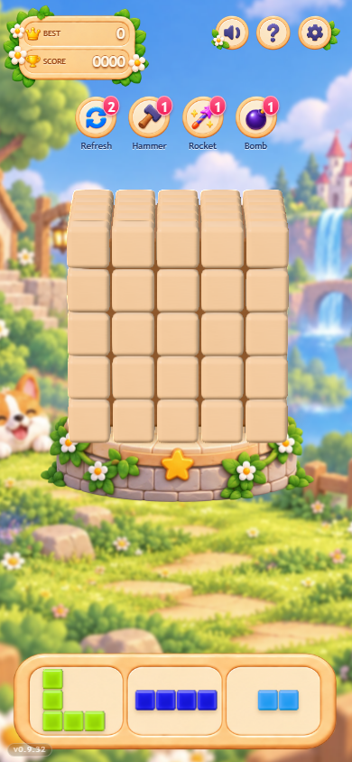
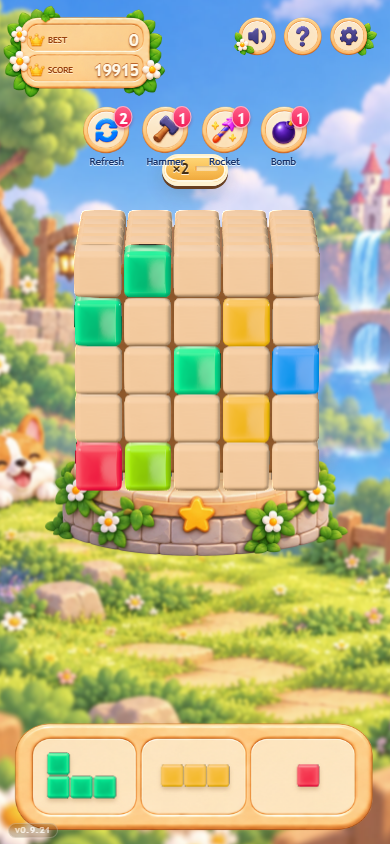

# 六面体与备选区方块：参考图差距分析及 Jeffy 修改交接

> **Luna → Jeffy｜2026-09-30｜待实施方案，不是已完成改版。**
> 范围仅为局内六面体、备选区及拖拽链路中的方块表现；不重做背景、HUD、石台、主页或玩法。
> 目标：把现在偏“正面格板＋亮边小按钮”的阅读感，调整为参考图里的**实心、饱满、亮面但不通透的彩色玩具积木**。
> 推荐先完成 **A：保持当前操作视角的材质／造型／候选呈现修正**。**B：参考图三面构图**单独评审，不纳入默认修改范围。

## 0. 交接结论：先读这一页

差距不是“还缺一张高清贴图”，也不是“没有使用 3D”。现有模型与共享架构已经成立；主要是以下几层因素叠加：

1. **观察角度不同**：参考图明显展示正面、顶面、右侧面；游戏默认停靠正对操作面，左右侧面不可见。提高反射不能补回这部分几何信息。
2. **彩块的材质方向偏移**：当前工作区加入琉璃／果冻式色芯、薄边散射和环境透光，配合微凸法线、窄亮反射，容易读成宝石按钮。目标应为实心亮面玩具，颜色主体比反射更重要。
3. **大平面被圆润和明暗切割削弱**：当前倒角占比偏大；光学鼓面又进一步强化软垫感。需要恢复“面平、边圆”的比例，而不是继续加圆角。
4. **备选区的投影、留白与阴影不同**：几何和材质虽同源，但候选接近完全正视，尺寸又受到槽内画布与包围范围限制。模型共享不等于最终像素一致。
5. **对照状态不一致**：参考是大量已放置彩块；最新本地截图是全空开局。必须用同一彩色存档对照，不能靠给正式开局预置彩块来“修美术”。

**执行顺序：冻结证据 → 单块材质 → 倒角和接缝 → 完整盘面 → 备选区厚度／尺度／阴影 → 多状态回归。每轮只解决一个主要问题。**

禁止直接做的“捷径”：贴图烘焙白边、整块自发光、彩块抬出棋盘、改六面体拓扑、整张方块截图替换实时 3D、偷偷恢复三面停靠、缩小取消区换取排版空间。

## 1. 依据与验证边界

### 1.1 目标图

本次用户消息中的 **941×1672 竖屏参考图**，标识：

```text
sha256:b4bd64845acd9ae9003ac3b18eef3165cf185b03ad65fb2eaa1c72119c3b2d82
```

识别特征：左上 BEST / SCORE 7200，中央彩色与奶油色积木六面体，下方蓝色 L、绿色折形、紫色九格候选，花草圆石台。**这是本轮目标图，不是当前实机图。**

本轮已直接查看会话中的原图，但没有获得可归档的原始本地文件；交给 Jeffy 时请将该原图与本文一起发送。没有看到原图前，Jeffy 不应仅凭材质关键词开工。以下尺寸关系为视觉拆解与建议，不是对原图的精密参数反演；原图也不是严格的格数／透视工程蓝图。

### 1.2 核对基线

- `package.json`：**0.9.32**；分析起点 HEAD：`ec6b855`。
- 源码核对包含当时已有的未提交渲染改动：`config.js`、`blockResources.js`、`toyLights.js`、`boardView.js`、`diagnostics.js`、`tools/screenshot.mjs`、`BOARD_SURFACES.md`，以及未跟踪的 `gemMaterial.js`、`gem-material-tests.mjs`。**这些不是 Luna 本轮所改，也不能假设 Jeffy 拉取 HEAD 就已包含它们。**
- 实施前由 Jeffy 与这些改动的负责人确认基线；不要 reset、stash 或覆盖他人工作来套用本文。
- 旧文档中的 0.94／0.97 边长、ACES、三面停靠等历史说明不能直接当当前值。参数以本次读取源码为准，操作约束见 [03 交互与表现](../Planning/03-交互与表现需求.md)。

### 1.3 现有图像证据

本轮**复用已有截图，不新跑构建、全量测试或截图服务**。附件均为完整原图复制，未修图：

| 证据 | 用途 | 限制 |
| --- | --- | --- |
| [A：v0.9.32 手机截图](assets/block-reference-review/current-v0.9.32-mobile.png) | 最新版本标签下的空棋盘、默认停靠与备选区，390×844；源文件修改时间 2026-09-30 00:55 | 不是本轮重新采集，也不是线上／物理手机验证 |
| [B：v0.9.21 彩色盘面历史截图](assets/block-reference-review/historical-v0.9.21-colored.png) | 辅助观察彩块的亮边、中心与反射关系，390×844；源文件修改时间 2026-09-28 23:56 | **旧版本，不可用来证明 v0.9.32 彩色棋盘最终观感** |





附件 SHA-256：A `343d80fc7165d20348de270864994a36d69cf26b75e92be1e19b82b80c80acb9`；B `d8f07ed020ce7d02bc5a1b894e6ded5f9fd5d9f819431e617a6b2d3f34ebf75a`。

**结论强度**：代码中的共享几何、默认相机、材质参数与候选布局算法是已核对事实；截图 A 的视觉现象是已有截图观察；历史图 B 与当前材质的联系、每项参数对最终观感的贡献仍需同版 A/B 实验证明。下文试调数值全部是起点，未渲染验收。

## 2. 参考图应提取什么

### 2.1 共同造型语言

- **实心小立方体**，不是薄片、玻璃、透亮软糖或切面水晶。
- 主体是大面积平整色面；边缘为连续的小圆倒角。圆润由边缘给，饱满由真实厚度和面间明暗给。
- 相邻方块紧密拼合，缝是窄而柔和的暖暗线，不是每格四周一圈厚黑框。
- 彩块：饱和红／蓝／绿／黄／紫，正面大部分仍为纯净本色；有限的亮边与小高光提示涂层。
- 空格：奶油桃木色，弱纹理、半哑光，比彩块低饱和。不能用高频木纹代替材质层次。
- 备选块：与棋盘同一玩具系列，但图中每格以近正面呈现，略可见厚度。不能误读为必须用夸张等距视角。

### 2.2 不应照搬的内容

不复制参考的固定分数、彩块分布、候选组合、看起来不完全一致的格数与透视，也不复制背景角色和品牌资产。本次目标是方块的视觉语言，不是把一张竖版海报按像素搬进可操作界面。

## 3. 差距 → 原因 → 修改抓手

| 优先级 | 差距与证据 | 实现原因 | 推荐修改 |
| --- | --- | --- | --- |
| P0：认清边界 | A 中正面方格整齐铺满，右侧不可见；参考三面明确 | `BOARD_STYLE.cameraDirection=[0.429,0.208,0.879]`；`bearingYaw` 从相机偏航派生，抵消相对侧视。FOV 6°／7°为弱透视 | A 路线保持操作视角。不得把“世界相机偏航 26°”误当“相对棋盘侧视 26°”；三面构图另走 §7 |
| P1：材质 | B 的彩块有显著中心／薄边变化，参考主要读作实心彩色面 | `GemMaterial` 加吸收、散射、内部反射、环境折射近似；其 depth 仍不透明，不等于真实透明玻璃 | 先关闭四项体积响应做同姿态 A/B；确认回到实心玩具方向后，再分别校准表面反射 |
| P1：形状 | A 中木块更像圆角小垫片；B 中彩块面内光斑强化鼓面 | `blockSize=0.95`、`blockRadius=0.13`；平面宽近似 `(0.95−2×0.13)/0.95≈73%`。另有彩块 `paintCrownHeight=0.032` 光学微凸 | 保留真实圆角立方体，先收敛微凸，必要时半径试 0.095～0.115；不增加正面厚度或位移 |
| P1：高光 | B 中部分高光读作大块反光斑，颜色被分成内外两层 | roughness 0.12、clearcoat 1、clearcoatRoughness 0.045；环境含竖反射板、小高亮点，叠加微凸法线 | 改成“保留亮边、减少整面反射占比”；不能只把 roughness 拉高到哑光，也不能把底色调黑压反射 |
| P1：备选厚度 | A 中候选像亮边扁方片，尤其细长形状 | 正交相机 `(0.12,0.18,8)`，仅约 0.86°偏航／1.29°俯仰；几何有厚度，但投影几乎不展示 | 候选相机单独试轻俯视与极小侧视，保留正面形状可读性；不得改逻辑 cells 朝向 |
| P1：备选尺度 | A 的候选单格明显小于棋盘，细节退化为像素亮边 | 画布只使用托盘内部 69% 高度；`usable=0.88` 再留白；`envelope=2.45` 与实际形状包围盒共同限制正交视野 | 先测实际 CSS px 与边界。优先去掉重复留白，而不是直接 scale 放大整个托盘／减小取消区 |
| P2：候选一致性 | 注释说全手牌单格等大，但四格长条可能独立缩小 | 每槽单独 `max(envelope, actualBounds)` 拟合。`Line 4` 超过 3×3 基准，可能单独扩大视野 | 同批三个槽用统一像素／世界单位比例，所有形状都参与上限计算；详见 §5 |
| P2：接触感 | 参考缝隙和投影说明块贴近托盘，不只是描边 | 候选 `addToyLights(previewScene)` 不开实时阴影；现有 CSS `drop-shadow(0 3px 2px #82522244)` 是整组轮廓投影，不能表达所有内缝 | 先保留并校准现有投影；必要时新增局部接触近似，避免直接给三个槽各加 SSAO／全套实时阴影 |
| P2：色彩状态 | 参考几乎是彩色积木主体，A 是奶油色空盘 | 正式新局六面清零是产品规则，不是渲染失败；候选实际渲染色由 `referencePalette.js` 映射 | 用固定彩色存档对照，不改新局，不改存档 RGB 与发牌；检查黄块与奶油空格在手机上的区分度 |

**不要误诊：**棋盘和候选已经共用 `blockGeometry`、`makeMaterial()` 及 `addToyLights()`，不是需要重新统一两套独立模型；两处也已经采用 Neutral 色调映射，不能先入为主归因于“一边 ACES 一边 Neutral”。不过棋盘有 composer／质量分档，候选直接 renderer 输出，最终像素仍须实测校准。

## 4. 六面体修改方案 A：不动操作视角

### 4.1 第一轮：只验证材质方向

固定现有几何、相机、曝光、色板、光源与局面，只比较当前彩块与“纯表面版”。利用已有开发调参接口：

```js
// 只在开发环境中做诊断对照；刷新恢复，禁止写入玩家设置／存档。
__voxalblastDev.tuneGem({
  scatter: 0,
  coreAbsorption: 0,
  internalReflection: 0,
  environmentTransmission: 0,
})
```

四项都关才是完整的体积响应对照；只关 scatter 仍有其他色芯／内部反射项。保留 `density` 无妨，因为本轮相关贡献均归零。默认保留类及 clone/copy 生命周期，不先删除 shader、测试或并发实现。

**第一轮过关标准**：彩块不再主要读作半透宝石；仍有光泽，不变成毫无体积的哑光色纸。以同版正面和转动帧一起评审，不以“新效果更复杂”作为通过理由。

### 4.2 后续试调表

以下是**候选区间，非一次全部改完的最终配置**。按表内顺序逐轮验证，每轮只改 1～3 组相关值。

| 参数组 | 当前源码 | 建议实验起点／范围 | 目的与门禁 |
| --- | --- | --- | --- |
| 彩块表面粗糙度 | roughness 0.12 | 起点 0.22，范围 0.18～0.26 | 放宽反射，保留饱和本色；若变粉／变灰，先查光能与反射，不直接改颜色 |
| 彩块清漆 | clearcoat 1；clearcoatRoughness 0.045 | 起点 0.85／0.12；范围 0.7～1／0.09～0.16 | 倒角保留亮点，但不要每格整圈发白；metalness 保持 0 |
| 彩块微凸法线 | paintCrownHeight 0.032 | 起点 0.012，范围 0.008～0.016 | 缩小面内反射变形；几何平面不变，不转成完全平板无受光 |
| 彩块环境反射 | paintEnvMapIntensity 0.85 | 仅在以上仍泛白时试 0.55～0.75 | 只影响彩块，不为了彩块一并压暗木块、背景与整个页面 |
| 环境小光点 | reflectionGlintIntensity 16 | 隔离测试 0，再按需要恢复小量 | 验证刺眼点光的贡献；主光箱和竖反射板不得同轮全部重做 |
| 几何倒角 | size 0.95；radius 0.13；segments 3 | size 先保持；radius 起点 0.105，范围 0.095～0.115；segments 保持 3 | 平面线宽比例约回到 76%～80%；不能变尖角，也不能靠增加细分解决造型比例 |
| 块缝 | 单位 pitch=1；size=0.95，缝 0.05 | 先保持；仅缝仍过宽才试 size 0.96～0.97 | 一次只试一个尺寸；更新预览、投影边界和 gemHalfSize 相关检查，棱角不能相交 |
| 木块 | roughness 0.48；clearcoat 0.45；crown 0.012 | 第一轮全部保持；若仍明显鼓面，再单独试 crown 0.004～0.008 | 木色亮但不油；不要为了追参考奶油色加重木纹或随机色斑 |

补充工程条件：

- 实际粗糙度由材质因子乘 `roughnessMap`；当前彩块贴图约 244/255，不能把 UI 数值误当最终粗糙度。
- 材质显式绑定 `toyEnvironment()` 必须保留。Three r172 下仅调 `envMapIntensity` 而让 `envMap=null`，可能被场景强度覆盖。
- `paintCrownHeight` 写入缓存法线贴图，不是现有 `tuneMaterials()` 可直接调的 uniform；试验需要重建对应缓存或刷新。别改了常量但沿用旧贴图，再误判参数无效。
- `toyEnvironment()` 也有缓存；环境光卡参数改变后需要重新生成环境并正确更新各 renderer 的 PMREM，不可只改 JS 变量。
- 不在 baseColor 画白边、阴影或固定方向高光；旋转时光应跟实际法线变化。`emissive` 与 bloom 不用于静态方块补亮。
- `voxelEdgeOpacity=0` 先保持。当前并无可见的额外轮廓线，不要把由倒角／AO产生的暗边误认为 EdgesGeometry 描边。

### 4.3 完整棋盘检查

98 个唯一实体、六面共享棱角、晶格 pitch、放置只换材质、空格与占用格齐平全部保留。接缝应表现为窄暖暗线；彩块可更亮面，但不应像从木面凹孔里突出的一枚按钮。

先看整体 240px 缩略图，再看正常手机像素，最后放大查法线与接缝。倒角减小后如出现棱角透壳、阴影 acne 或明显锯齿，应定位几何／阴影问题，不能用更深 AO 全部遮掉。

## 5. 备选区修改方案

### 5.1 轻微展示厚度，不改变形状朝向

- 保持正交相机。首个实验设相对俯视 **约 6°**、侧视 **约 2°**，建议范围 4°～8°／0°～3°；这些为设计起点，不是原图测得角度。
- 以目前距离 z=8 举例，相机可从 `(0.12,0.18,8)` 起试约 `(0.28,0.84,8)`，lookAt 原点。保持 y 轴朝上、无 roll，让 L／J、S／Z 不歪、不镜像。
- `createPiecePreview()` 和 `updatePiecePreviews()` 两处目前都写死相机位置；须抽成一个入口。否则只改创建处，下帧会被重置。
- **先更新相机矩阵，再计算相机空间包围盒和 fit**。把新增可见厚度纳入框内，不用 CSS transform 伪造透视。
- 候选展示姿态只属于 preview scene，不写回 getCells、棋盘面基底或拖放映射。

### 5.2 统一像素尺度，避免四格长条独自变小

现有内部 `mesh.scale=0.8` 与 `flatPreviewPositions(...,0.8)` 成对缩放，缝隙比例依旧正确。**不要单改一个值**，否则会相交或把拼块拆散；直接放大 root 也可能被相机 fit 抵消。

建议计算流程：

1. 获取三个槽真实 canvas 的 CSS 宽高、投影后的真实几何包围盒，计入新相机角度与厚度。
2. 保留基础 3×3 展示范围，防止三枚 Dot 被无限放大；实际形状大于此范围时，以实际范围参与计算，特别覆盖横／竖 `Line 4`。
3. 先求每个槽能够容纳的像素／世界单位上限，再取三槽的最小值作为**该批共同的比例**，统一设置三个正交相机。只在换批或 resize 时重算，不在拖走一块时让剩余两块突然放大。
4. 若要不同批次也完全等大，则用全候选池最坏包围范围定比例；代价是九格和小件都略小。首选“同批等大＋跨批有限变化”，与美术验收一起确认，不默认强行填满每槽。
5. 单格 `Dot`、双格与九格依然是相同单位尺寸，而不是每件都填满卡片。

**参考图不是把每件放到一样大，而是让每个单格读作同一种积木。**

### 5.3 尺度目标与可行性限制

- 先记录 390×844 下单格、完整形状、托盘内框的 CSS px；当前图 A 目测候选单格约 20～23px，仅作待测线索。
- 首轮只试将槽内 `usable` 从 0.88 放到约 0.92（前提是连同阴影仍完整）。这只会带来约 4.5% 的尺寸变化，**不能承诺它单独解决所有“小”的问题**。
- 检查 CSS 的 14%／17% 留白是否与托盘真实内框重复保守。只能向内框空白扩展，不能压住金边、花饰或改变点击／取消范围。
- 390px 宽三槽常使四格长条成为瓶颈。若安全内宽只有 90px，四格单格不可能在留缝前提下达到 28px；优先不裁切与同批一致，不设置所有形状一律 30px 的错误硬指标。
- 如仅改内部使用率仍无法达到理想厚实感，记录“槽宽限制”，把调整整条托盘布局作为后续独立提案，不牺牲下方翻面手势区。

### 5.4 阴影与色彩一致性

现有 CSS 投影已经存在，**不是从零加阴影**。先按新尺度校准投影偏移／模糊，以托盘上的近接触阴影为目标，不是漂浮的大黑椭圆。若内缝仍不足，可复用程序 AO 或在 preview scene 增加轻量接触贴片；新增物件不纳入方块拾取、候选包围盒，不盖住格缝，不按每格创建独立纹理。

不为三个候选引入三套 composer／SSAO／真实透射。仍复用槽位 renderer、canvas 与共享资源，换批只换网格／材质，不退回重新创建 WebGL 上下文。

这里的“材质同源”是同工厂／配方／贴图，不是同一材质实例：棋盘走 `paintMaterial()` 缓存，候选走 `makeMaterial()` 创建自有材质，清理候选时会 `dispose()`。**不要顺手把候选改成直接借用棋盘缓存材质**，否则现有释放路径可能释放棋盘仍在使用的实例。若日后确需缓存复用，必须另做所有权和生命周期改造，本轮不需要。

同一蓝块比较候选 → 拿起 → 合法落点 → 放置后的色相、倒角与光向；不能仅因两边都叫 Neutral 就认定像素相同。允许观察角度造成合理反射差异，不允许突然换色或从亮面变哑光。另测非法灰色预览、取消回弹快照、开场临时材质，保证 clone/copy 保留目标表现且正确释放资源。

## 6. 修改入口与禁止越界

| 文件／函数 | Jeffy 应做什么 | 注意事项 |
| --- | --- | --- |
| `src/rendering/config.js`：`BOARD_STYLE`／`GEM_STYLE`／`LIGHTING_STYLE` | 统一记录通过验收的参数；试验值先不要全量落码 | 当前未提交改动需先确认；A 不改 camera／bearing／cubeLift |
| `src/rendering/blockResources.js`：`createBlockResources`／`makeMaterial` | 保持统一几何／材质入口及缓存；材质配方收敛 | 不另起候选专用模型；不释放仍被棋盘使用的共享资源 |
| `src/rendering/gemMaterial.js` | 优先保留兼容类，关闭或收敛体积贡献 | 不未经评审删除他人未提交实现；保留 clone/copy 验证 |
| `src/rendering/woodTexture.js`：`buildSurfaceCanvas` | 微凸法线、弱纹理／粗糙度的生成和缓存更新 | BaseColor=sRGB，normal／roughness／AO 为数据通道 |
| `src/rendering/toyLights.js`：`toyEnvironment` | 单独验证小光点／反射板贡献 | 各 renderer 共用源纹理，各自缓存 PMREM |
| `src/rendering/pieceView.js`：`createPiecePreview`／`updatePiecePreviews` | 相机参数去重；同批共享像素尺度；真实包围盒含厚度 | 保留 renderer 复用、回弹快照、candidateFrames 诊断 |
| `src/reference.css`：候选内框与 `.piece-thumb` | 仅必要的内部留白／投影调整 | 不改托盘外部位置、取消命中范围、背景或 HUD |
| `src/rendering/gameScene.js` | 只作为对照检查 composer／质量档，不默认重写 | 手机禁用 SSAO 的既有降级不撤销 |
| `tools/screenshot.mjs`／诊断／相关材质测试 | 补同版材质和尺度证据，不删除旧不变量换绿灯 | 固定局面与质量档，不能把旧验证数字贴作新结果 |

禁改：`src/game/**`、`src/platform/**`、候选池／权重／存档 RGB、棋盘 98 格拓扑、翻面门槛／轴锁定／停靠对称性、取消与边缘翻面语义。渲染配色如确需调整，只通过 `referencePalette.js` 单独评审，不修改逻辑色标识。

## 7. 方案 B：想要三面构图，必须单独决策

**本轮建议不实施。**参考图的体积感有一部分来自“同时看见三面”，仅修 A 无法做到整张图同构，这是明确的保留差异，不是参数还没拧够。

- 当前停靠正对镜头、左右微调对称是明确交互约束。只改相机 yaw 时，派生 bearing 会跟随，仍然看不到侧面。
- 如果固定停靠露右面，就会重新引入左右面可见量不对称；必须由制作人明确接受新的视觉／操作取舍，而不是修改探针放宽要求。
- 可先在**独立评审画面**展示同材质的三面六面体，说明潜在收益；不把评审姿态自动设为游戏默认，不新增玩家未要求的自动镜头切换。
- 只有 B 获批准才进入相机／停靠方案设计，记录 FOV、距离、相对俯仰／偏航、主面／侧面面积比例、投影宽度、翻一面所需 px，并完整复测拖放与翻面手感。

不能以“相机参数改得很少”为由把 B 混入 A。

## 8. 图片制作：当前不需要新增生成图

当前已有明确原图、真实 3D 模型与程序材质入口，主要问题是渲染解释和屏幕呈现，**不建议先生成一套纹理再找地方贴**。本轮仅附可追溯的真实截图，无新生成资产。

若第一轮仍对“亮面玩具／琉璃”存在理解分歧，由 **Luna** 制作单块材质对照板：同一造型、同一构图和上左主光，展示奶油空格＋蓝绿紫彩块，在正面、轻侧视和手机实际尺寸下比较；明确它是设计示意，不是假称实机效果。图应无文字／数字／UI，标注由文档完成，避免文字生成误差。

只有程序弱纹理确实无法满足目标时才考虑新增中性 baseColor 资源：不含高光、阴影、透视和颜色编码。法线、粗糙度、AO 仍用可验证的数据生成流程，不把普通彩色图片直接当这些通道。运行时不调用生图服务。

## 9. 分轮任务与交付门禁

### R0｜重新冻结基线（Jeffy 开工第一步）

- [ ] 核对目标原图、实际分支／commit、未提交渲染改动与本地运行 URL。
- [ ] 同一版本保存空盘和固定彩色盘面；候选至少覆盖 Dot、Line 4、L／J、S／Z、Rect 6、Block 9。
- [ ] 固定视口、DPR、质量档、姿态、相机 zoom、随机种子、存档、动画结束时点。
- [ ] 输出 before：全屏、单块等倍裁切、候选等倍裁切、正面及旋转中间帧。当前附件仅供分析，不能代替此步。

### R1｜单块材质（至少拆成体积响应、表面反射两轮）

- [ ] 先纯表面／当前版 A/B，不同时改几何和灯光。
- [ ] 再调粗糙度／清漆，必要时独立调微凸与反射环境。
- [ ] Luna 认可“实心亮面、大色面、非果冻／非哑光纸片”后再铺完整棋盘。

### R2｜几何与完整盘面

- [ ] 只有材质后仍显鼓包才收敛半径；再单独判断缝隙。
- [ ] 检查 98 实体、共享棱角、八角／斜视缝、不穿帮、不闪烁、不抬块。
- [ ] 空盘与彩盘都清晰；黄块不混为空格，转到背光面仍能辨认占用。

### R3｜备选区

- [ ] 依次验证轻微厚度、共同尺度、内部留白、投影，各轮保留对比。
- [ ] 三槽同批单格屏幕尺寸一致；建议投影面宽误差不超过 5%，以同姿态、同槽尺寸测量。没有逐形状任意放大 Dot。
- [ ] Line 4 横／竖、九格、L／J 与 S／Z 均不裁切、不镜像；阴影不压内框。
- [ ] 拖走一块时剩余两块不跳大小；换批沿用 canvas／renderer；取消区与翻面空带不缩水。

### R4｜最终验收（以下尚未执行）

- [ ] 视口至少 390×844、320×740、844×390、1440×900；追加 1280×720 与 2048×900 抽查。核对工具实际覆盖尺寸，缺的要补录。
- [ ] `npm test`、`npm run build`；记录实际结果和已有警告，不复制历史通过数量。
- [ ] `npm run probe:interaction`、`npm run probe:drag`、`npm run probe:swipe`、`npm run probe:framing`、`npm run probe:intro`；按改动补 `probe:ui`／`probe:churn`。工具依赖的实际 URL 与运行方式以工具源码为准。
- [ ] 正常／非法／取消／跨面／共享角格／续玩／开场／减少动态效果全部走通；棋盘数据与材质调参互不污染。
- [ ] 手机质量档无 SSAO 时仍有干净缝隙和接触感；桌面不出现 AO 厚黑框。
- [ ] 同设备同局面比较帧时、draw calls、program 数、纹理／几何数量；原则上无新增后处理 pass，不通过重复创建 renderer 换美术。
- [ ] `git diff --check`、相对链接检查；同步最终美术参数与实施记录，但保留历史证据标签。
- [ ] 至少一次物理手机复测；未测则明确写“未验证”，不以桌面模拟替代。

**视觉退回条件**：面中心大块泛白／发灰；整圈自发光；像透明软糖；正面鼓成软垫；候选像平面贴纸；每槽单格大小随形状乱变；手牌到棋盘换材质；为了三面构图破坏操作对称性。任一项未解决不得仅凭构建通过交付。

### 每轮回执模板

```text
轮次／commit／工作区补丁：
本轮唯一假设：
只改了哪些参数／函数：
未改的玩法与交互边界：
Before / After 路径（同局面、视口、DPR、姿态）：
390px 手机实际尺寸观察：
工程检查／性能数据：
尚未验证与保留差异：
Luna 结论：通过 / 附条件通过 / 退回
下一轮最大的一个问题：
```

## 10. 本次文档交付说明

Luna 本轮只新增本文与两张已存在截图的证据副本，并在文档导航加入入口；**没有修改游戏实现，没有新增生成图，没有升级版本**。本文的参数是待验证方案，不把旧截图、旧测试或代码推断写成当前实机验收。参考流程见 [美术优化流程](VISUAL_REWORK_WORKFLOW.md)，现有实现说明见 [棋盘表面与接触阴影](BOARD_SURFACES.md)。
