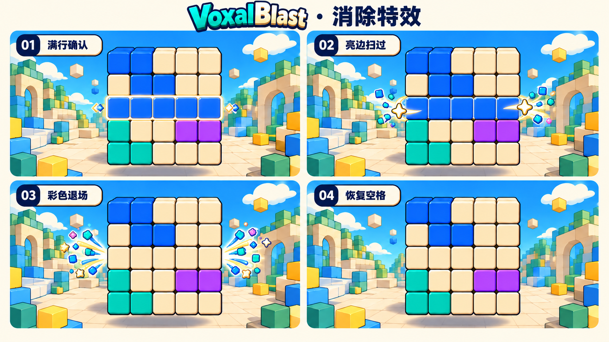
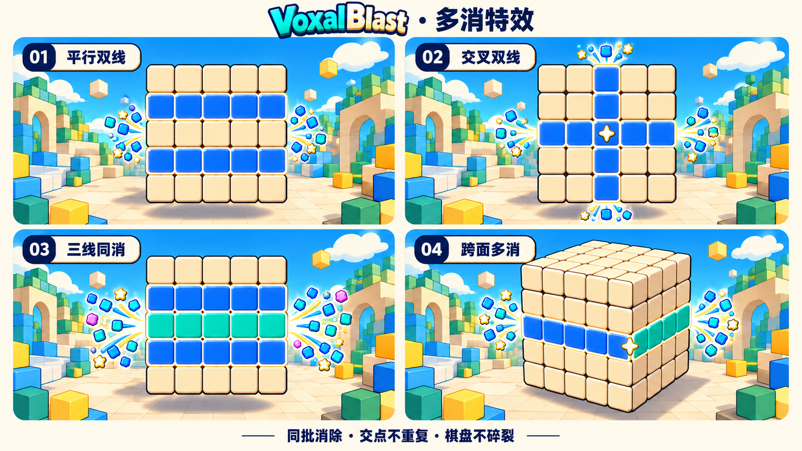

# 卡通消除特效实现交接｜Luna → Jeffy

> **2026-10-09｜状态：设计与资产交付，待工程接入及实机验收。**
> 初始核对基线：`package.json` **0.13.1**，HEAD `eb95fa2c501e687bf679d38cc8a1a941daa3d331`。收尾时并行开发已推进至 **0.13.2 / `b2c3985`**；已比对两版，`effects/game/audio/gameScene` 未变，`main` 新增地面转动输入接线、配方关闭主盘微浮动等由其他任务提交，本单不覆盖。本轮不改 `src/`、规则、音频或游戏版本。已有 `public/__three-probe.html` 及期间其他人的渲染/探针改动均不纳入本轮提交。
> **Jeffy 只需收到本文链接即可开始**：参考图、生产资产、参数、接入点与验收均在仓库，无需找聊天附件。[在线入口](https://github.com/PPZ-Game-Life/VoxalBlast/blob/main/docs/Technical/CARTOON_CLEAR_VFX_HANDOFF.md)。

## 0. 本轮做什么，不做什么

**方向：彩色方片轻快弹出、奶油黄小星短闪、短亮弧扫过；先看清消除关系，再感到爽快。** 不做破碎、火焰、烟雾、激光或满屏闪白。棋盘始终完整，消除仅让占用颜色退场、恢复奶油空格。

- 做：正常落子的单线、平行双线、交叉双线、三线及以上、跨面多消；共享格/面线去重；粒子上限；暂停与下一次操作的清理；高低档与 reduced-motion。
- 保留：真实结算、分数、v1 旧局兼容、现有三类奖励短签、音效总线、触感、主盘与候选材质、98 格实体、镜头和手势标尺。
- 不做：重画 UI/背景、Loading、道具特效改版、新纪录演出改版、计分/荣誉重命名、新增奖励、自动转面、新粒子引擎、新 WebGL context。
- **优先级**：本交接接管“正常消除的局部图形、时序、粒子与清理”；[计分简化交接](SCORE_REWARD_SIMPLIFICATION_HANDOFF.md)继续决定奖励/短签/音效与震动；[旧消除音效交接](CLEAR_CELEBRATION_AUDIO_HANDOFF.md)保留未被接管的道具、纪录、音频生命周期。不要把旧 L4/L5 大纸章、长彩带和新粒子再叠一遍。
- 画面基础继续服从 [品质收口单](FLOATING_WORLD_GAMEPLAY_POLISH_HANDOFF.md)、[05 §0b](../Planning/05-美术方向与视觉规范.md)。本轮不能用“特效更好看”作为改相机、减小棋盘或提高全局曝光的理由。

## 1. 已确认的目标图与读法

### 1.1 单线时间顺序



从左到右、从上到下：满行确认 → 亮边扫过 → 彩色退场/粒子展开 → 恢复普通空格。

### 1.2 多消是四种事件，不是四帧



- 双线不是两套单线特效全量相加；交叉处不是两次爆点。
- 三线图只是“3+”的代表，四、五线及更高情况也受同一总预算约束。
- 跨面图的三分之四视角只是解释两个面；**不在消除时自动旋转镜头**。
- 图中蓝/青用于区分线的分布，不允许同一共享格在两个面拥有不同占用身份。
- 原图是设计参考，不是准确的实体透视、网格拓扑、粒子计数或整屏背景。[来源及误读警告](../assets/cartoon-clear-v1/references/README.md)。

## 2. 当前代码事实与接入点

以下是基线上静态核对的事实，不是本轮已经改好的实现；行号随工程迭代可能移动，优先按函数名查找。

| 入口 | 当前行为 | Jeffy 本轮动作 |
| --- | --- | --- |
| `src/main.js:onDrop`，约1129–1187 | `settlePlacement` → 声音/触感 → 消耗候选 → `renderBoard()` → 短签/总分跳字 → `spawnClearEffects(lines, level, {rewardEvent})` → 慢放/保存/补牌 | 保持此结算先行关系，只把额外表现上下文传入 FX；不等待动画再更新棋盘 |
| `src/game/gameSession.js:settlePlacement`，约311–393 | 返回 `result, lines, lineCount, level, score, rewardEvent, ...`；v2 的 `rewardEvent.eventId` 每次成功落子增长，旧局可为 null | 只读结果，不能在 FX 再结算一次 |
| `src/game/board.js:place/findFullLines/findAllFullLines` | `lines[].cells` 是三维坐标；row 描述带 `face,v`，col 带 `face,u`；`cellsCleared` 是数量，不是数组 | 用 `lines[].cells` 构造视觉描述，不能从数量编造格子 |
| `src/game/scoring.js:uniqueLines/countScoringLines`，约137–173 | 按整条物理线的格集合去重；共享满棱可 raw 报两条面线，但新计分只算一条物理线 | 复用相同纯几何去重口径，不改变计分；不能按 raw `lines.length` 加强粒子 |
| `src/rendering/effects.js:createEffects/spawnClearEffects`，约117/600 | 已有 `BatchedRenderer`、独立场景 FX、去重、事件预算、低配、减少动态效果、生命周期 | 替换正常消除分支；不要重建一个顶层特效系统 |
| `effects.js:uniqueEntries/segmentKey`，约287–303 | 去重格与整段；共享格法线来自 first line 的 face，不保证可见/合理 | 改为显式面/端点分配，见 §4，避免枚举顺序决定发射方向 |
| `src/rendering/boardView.js`，约68–106 | `cellToWorld/cubeVector/facePlaneLocalCenter` 提供局部坐标/轴，再由 FX 应用 `cubeGroup.matrixWorld` | 复用，禁止复制一套面旋转表 |
| `src/rendering/config.js:CELEBRATION`，约792–867 | 旧纸色、薄卡、L1–L5预算6/12/24/40/64，尾长0.42–1.4秒 | 新建具名 `CARTOON_CLEAR` 参数块，仅正常消除使用，不顺手改变道具/纪录 |
| `src/audio/gameAudio.js:playClear` | 一个主要 cue，次要奖励尾音已仲裁 | 保留。新 FX 模块不发声，不按每条线调用一次 |
| `src/ui/hud.js:showRewardNote` | 消费真实 `rewardEvent`，其停留时间长于粒子，快速奖励可能叠多个 DOM | 文本时间独立；新图集不画文字。若复测证实遮挡，做“最新短签替换旧短签”，保留完整明细和分数，不伪造合并奖金 |

### 2.1 不要把现有缺口当作现成能力

- `effects.js` 里的 `eventEpoch` 目前只初始化/报告，没有真正递增取消语义；本轮要落实。
- 旧装饰 cap 是**每事件**8/4，并非全局；旧 band 不计入它。新方案必须显式区分全局存活、每事件预算和线标记。
- 旧 `paperStart` 不等于真实延迟发射；现有 burst 在系统 t=0 发出。下面的时序要以真实采样证明，不能只改配置文字。
- 贴面标记所谓 `followCube` 当前是转动后80ms退场，不是每帧追随；当前 world-space 飞片不能直接套 cube-local 坐标。
- 设置/隐藏/主页并未全部即时清掉 FX；暂停主要停 update，主页隐藏 group，返回后才按墙钟回收。需要 §7 的显式清理。

## 3. 已交付生产资产：不需要 Jeffy 抠图

**采用可编辑 SVG 重新构造轮廓，再输出透明 PNG。** 没有购买素材或新增在线图像依赖；概念图不作为贴图来源直接裁切。

- [资产用途和采样说明](../assets/cartoon-clear-v1/ASSETS.md)
- [生产贴图检查板](../assets/cartoon-clear-v1/preview.png)
- [透明图集 PNG](../assets/cartoon-clear-v1/runtime/atlas.png) · [图集坐标 JSON](../assets/cartoon-clear-v1/runtime/atlas.json)
- [文件清单与哈希](../assets/cartoon-clear-v1/manifest.json) · [资产校验记录](../assets/cartoon-clear-v1/asset-checks.json)
- [可复现构建/校验工具](../../tools/build-cartoon-clear-assets.py)

| ID | 用途 | 禁用方式 |
| --- | --- | --- |
| `confetti-blue` / `confetti-teal` / `confetti-pink` | 小方片主粒子；蓝/青为主，粉只作少量点缀 | 不拉成全尺寸破碎方块，不每格发一套 |
| `star-pop` | 线端/交点的奶油黄小星 | 不作为整盘大爆炸，不放到分数/落点上 |
| `sparkle-cream` | 确认与收束闪点 | 不循环闪、不靠加法混合灼白 |
| `dot-blue` | 少量圆点补层次，低配先减掉 | 不做亚像素噪点云 |
| `swoosh-cream` | 线端短亮弧 | 不拉成贯穿棋盘的长激光 |
| `dash-blue` | 短方向线/弹射拖尾 | 不接长粒子尾巴，不每帧累计轨迹 |

图集为 **512×256、4×2、8个128×128 tile**；统一中心 pivot，具体 alpha 占用框和 UV 以 JSON 为准。**atlas+JSON实际59,081 bytes（约57.7KiB）**。SVG与独立 PNG 为编辑/回退用途，不要与 atlas 同时全量加载。

本机构建已执行：CairoSVG缺少原生DLL，构建器自动用已安装Edge无头栅格化，再以Pillow做4倍超采样降采样；未新增项目依赖。已通过8贴图透明边/抗锯齿、图集逐tile一致、manifest哈希和尺寸检查，并目视检查16/32/64px及四种背景。此结果不等于GPU接图验收。

### 3.1 部署及采样合同

本轮资产暂存 `docs/assets/cartoon-clear-v1/`，**不会随 Vite public 自动发布**。Jeffy 接入时仅将 `runtime/atlas.png` 与 `runtime/atlas.json` 复制到 `public/art/cartoon-clear-v1/`，更新资源清单；运行时通过 `import.meta.env.BASE_URL` 构造地址。不要复制两张参考大图、预览、SVG源或检查报告进首包。

- `TextureLoader` 路线：`colorSpace=SRGBColorSpace`、`flipY=true`、`generateMipmaps=false`、`minFilter=magFilter=LinearFilter`、ClampToEdge、`premultiplyAlpha=false`。
- 材质：白色调制，`transparent=true`、`NormalBlending`、`depthTest=true`、`depthWrite=false`；不投射/接收阴影，不拾取。默认不 alphaTest 裁掉抗锯齿边；性能问题需实测再调整。
- 源图是 straight/unassociated RGBA，透明边已有局部颜色扩张；不再次乘预乘 alpha，也不把奶油检查底烘进图集。
- JSON pixel rect 以左上为原点，普通 bottom-left UV 为 `u0=x/W,u1=(x+w)/W,v0=1-(y+h)/H,v1=1-y/H`。若走 ImageBitmap，必须另核 `imageOrientation`/premultiplyAlpha，不能照搬 TextureLoader 的 flipY。
- `three.quarks` 当前包支持 `startTileIndex/uTileCount/vTileCount`；BillBoard UV chunk 的 tileIndex 从左上逐行编号。使用 **4×2 + 固定 tileIndex**，不加 `FrameOverLife` 把八种形状当动画顺序播放。当前 0.10.8 的 `startTileIndex` 必须传 `new ConstantValue(tileIndex)`：运行时会调用 `.genValue()`，裸数字 `1–7` 会报错，裸 `0` 只是因 falsy 偶然回退到 `ConstantValue(0)`，不能拿它证明数字参数可用。
- 首个视觉门禁必须逐一显示8个tile，特别检查上下排、swoosh左右朝向、16px边缘；“文件已读入”不能代替正确采样。
- 贴图未就绪/加载失败：使用简单程序方片/四角星或仅亮边反馈，禁止阻塞第一手、进入无限 Loading 或吞掉分数反馈。开发诊断记录 fallback。

## 4. 一次落子，一个视觉事件：去重与分配

建议在 `effects.js` 内抽出纯函数，或新建 `src/rendering/cartoonClearPlan.js`（**待 Jeffy 实现**），只做表现规划，不拥有棋盘规则。

### 4.1 输入与身份

```text
输入：raw lines + level + rewardEvent + 当前clearScopeEpoch + resolved quality
可选：触发时相机/棋盘姿态及viewport安全区
内部key：clearScopeEpoch + 本地递增fxSeq（v1旧局也必须唯一）
sourceRewardId：rewardEvent?.eventId，仅用于关联诊断，不替代本地key
```

`clearScopeEpoch` 不是只在新局增长的 session/run 版本号：设置、帮助、主页、hidden、局终、重开与恢复存档等取消正常消除作用域的转场也必须递增它，使旧事件回调失效；它不得顺带取消道具、短签、音频或新纪录作用域。

保留两份集合：
1. `physicalLines`：排序三维坐标后连接为整段 key，去掉同一满棱的重复面报告；其数量 `physicalLineCount` 决定本次正常消除视觉预算。
2. `faceFootprints`：保留实际报满的 face/row/col，决定在哪些表面画亮边。物理线去重**不能**导致另一侧可见表面漏提示。

`uniqueCells` 为所有消除坐标 union，只清理/记录一次。交叉双线是两条 physicalLines、9个唯一格；共享满棱可能两条raw face lines，但只有1条physicalLine、5个唯一格。FX不改 `score/rewardEvent/level`，也不能用传入的 `level/rewardLevel`、`wipedFaces`、`facesHit` 或 raw `lines.length` 代替 `physicalLineCount` 选择下表预算。

### 4.2 发射位与交点

- 主粒子从各物理线的**外端**发射；不能每个格子生成同预算粒子。
- 交点是事件内部集合：同一空间交点最多一枚 `star-pop`。位置相同的多个端点合并；非同位置不能仅因投影相近就删掉真实线确认。
- 跨面共享棱：保留各可见 face 的贴面轮廓，但共享段亮度取 max 而不是 add；同坐标装饰只归一个发射位。先选朝向相机的可见面，正面对相机者优先，再按稳定face id打破平局；不要沿raw数组的第一个face随缘决定方向。
- 看不见的背面只保留真实遮挡；不通过透明顶层“补给玩家看”，也不把背面结果伪装成正面粒子。
- 对可用端点做轮转分配，总预算先扣闪点/弧线，再分方片；最多8个装饰发射位。端点多于8时稳定抽样，**真实线轮廓仍全部保留**。
- 伪随机只影响方片角度/速度，使用独立VFX种子（event key + physical signature），不消耗发牌/棋盘随机源。

### 4.3 预算（建议实现起点；新 normal-clear sprite 装饰全部计入）

| 同一落子 `physicalLineCount` | 标准档事件上限 | 低配事件上限 | 最晚收净 | 构图 |
| --- | ---: | ---: | ---: | --- |
| 0 | 0 | 0 | — | 现有落子反馈，不触发清除粒子 |
| 1 | 14 | 7 | 360ms | 两端小弹射，最多2个星/闪点 |
| 2，平行或交叉 | 22 | 11 | 420ms | 四端错落，交点只一次，最多4个星/闪点 |
| ≥3（可包含跨面） | 32 | 16 | 420ms | 一组协调扇面，最多4个星/闪点、4个弧/短线 |
| reduced-motion | 0飞行/弧线，最多1个静态闪点 | 同左 | 120ms | 局部轮廓一次淡出，声音/文字按原偏好保留 |

以上是**整次正常消除事件的新 sprite 装饰合计**，包含方片、星、点、swoosh、dash，不是只有“纸屑”预算。3+超过三线不继续膨胀；跨面仍按实际 `physicalLineCount` 走1/2/3+对应行，不在表外加第二份“跨面奖”。当前运行时用 `quality.lowPower` 布尔映射high/low两档；不宣称已有medium或自动FPS动态降档，`quality.particlesPerLine`也不是本轮预算入口。

- 新正常消除池全局活跃装饰上限 **64/32**，最多2个重叠清除事件；第三个到来优先退掉最旧事件尾粒子，保留当前事件线确认。不为保旧动画增加输入锁。
- 线轮廓与§5.1可选彩色残像不计入上述 sprite 数量，但必须分别封顶、合批并进入report：线轮廓不能被装饰数量上限裁掉，每事件最多150个去重表面格；彩色残像最多 `uniqueCells` 对应的98个唯一实体身份，不得每格新建material/drawcall。重复线不会增加同一面格的亮度。
- 新事件挤掉旧装饰不等于取消旧结算/分数/声音。旧道具/纪录不属于本表的 normal-clear 预算，仍使用原系统；两个系统并行时的总live计数必须在report显式分项，不能只报新池“看似未超”。
- 手机横屏/安全边距不足：装饰预算减半，若粒子会盖候选或出视口则不发该粒子；绝不缩棋盘腾地方。reduced-motion优先级最高。

## 5. 时序与具体表现

`t=0` 为真实成功落子完成结算返回时，不是按下/拖拽开始。以下时长用未乘慢放系数的实际秒；不要用新 `setTimeout` 队列播放特效。

| 时间 | 画面 | 实现约束 |
| --- | --- | --- |
| 0–65ms | 命中线的局部奶油亮边快速出现 | 同批起亮，多线错峰≤25ms。格线始终能读；不改实体 transform |
| 65–140ms | 短亮弧向线两端展开；交点小星短闪 | 不画整条激光；不同面沿自己的切平面，不在屏幕上强拉一条直线 |
| 110–220ms | 方片、少量星/点短促弹出 | 所有发射在140ms前完成；source snapshot确定方向，不因之后转面乱改已飞出粒子 |
| 220–360ms | 减速、缩小、淡出 | 单线360ms前0存活；不让粒子陪短签持续 |
| 360–420ms | 仅多消的最后少量尾粒子收净 | 420ms后本事件的轮廓、闪点和粒子全部为0 |

### 5.1 “彩色退场”与真实占用不能混淆

现有路径在生成FX前已经 `renderBoard()`；清除占用不应为了分镜延迟160ms才生效。**首版采用“真实格立即恢复奶油 + 窄轮廓/扫痕说明刚清了哪些格”**。图中前两帧蓝面是消除关系示意，不要求把逻辑占用蓝色写回来。

若基础版本验证后仍需要更明确的漆色退场，可作为单独R2扩展：在 `main.onDrop` 的 `settlePlacement` 前克隆最多98格 `board.occupied()` 的坐标/颜色到独立Map，并用 `faceLattice(face,u+origin.u,v+origin.v)` **合并本次新放入格**及 `piece.shape.color`；成功结算后只从真实 `lines[].cells` union提取色快照。当前result没有 `cleared.cells` 或原色，结算后tile材质也不能还原事实。残像用独立短命表面对象淡出≤160ms，不写回Board、不改实体共享material或transform；新放置/预览覆盖该格立即撤掉。只快照旧盘会漏刚放下就清掉的格，不能省略合并步骤。

残像若需贴盘随浮动，应独立挂cubeGroup下使用local坐标或逐帧更新world矩阵；不能把整个现有world-space fxGroup改挂cubeGroup导致二次旋转。层级按§6.2的新增layer3合同。**无快照时不猜原色**，不根据图里的固定蓝色重绘真实棋盘。本交付不依赖该扩展才能开始施工。

### 5.2 尺寸、运动与颜色

以一个格距为 `cellPitch`，CSS px指可见非透明图形，不是128px整张tile：

| 元素 | 建议可见尺寸 | 运动 |
| --- | --- | --- |
| 方片 | 0.12–0.20格，手机目标4–9 CSS px | 两端向外0.3–0.6格、少量上扬后回落；旋转≤80°，不翻成细线 |
| 小星 | 0.18–0.28格，目标7–12px；绝不超过半格 | 0.8→1.1→0的单次scale包络，局部闪一次 |
| 小点 | 0.05–0.08格，小于2px就不发 | 短距离补层次，低配优先剔除 |
| 弧/短线 | 可见长0.20–0.40格，薄且短 | 沿线轴向外，不超过端点0.45格；不是持久轨迹 |
| 贴面轮廓 | 约1–1.5 CSS px，受投影校正 | opacity≤0.75，一次亮起收净，不高频闪烁 |

- 主粒子蓝 `#2F70E8`、青 `#18BBA6`；粉 `#E65B86`占方片≤15%；星奶油 `#FFF1CC`配暖黄；轮廓深蓝 `#20334C`。不能每条线换一套随机色。
- 用 JSON alphaBounds 换算可见尺寸：如果某粒子图形只占tile宽70%，quad宽要除以0.7，不能把透明边也算作图形。
- 方片参考弹射：初速沿消线端向量2.0–3.0格/秒，切面上方向0.8–1.4格/秒，向外法线0.05–0.15格/秒；重力方向采用场景向下、加速度约4–7格/秒²，最后三分之一寿命淡出。这是小幅短弧，不是持续喷泉。
- 可以复用 Quarks `ApplyForce`，或一个受控自定义Behavior；不要同时绝对写位置又让引擎重复积分速度。需要真实时间取样证明先上扬后回落，光改 `SpeedOverLife` 不能宣称已有抛物弧。
- 左右不必机械镜像，但各端点总量应平衡。粒子不得跨棋盘中央汇聚为光团。

## 6. 推荐工程实现：复用现有批处理

### 6.1 分模块，不拆顶层游戏循环

| 文件（待实现） | 职责 |
| --- | --- |
| `src/rendering/cartoonClearPlan.js`，建议新增 | 纯函数：物理线/面轮廓/交点/端点去重，事件预算，种子；方便Node测试 |
| `src/rendering/effects.js` | 消费plan，复用BatchedRenderer/材质池；正常clear走新sprite方案；道具/纪录旧路径保持 |
| `src/rendering/config.js` | 新 `CARTOON_CLEAR` 的预算、尺寸、时序与质量降级；不要用旧L5时长覆盖新420ms |
| `src/main.js` | 仅表现参数、pause/drag/home生命周期接线；不改变成功落子/计分顺序 |
| `src/rendering/gameScene.js` | 仅新增clear FX layer3的beauty可见/NormalPass排除合同，不修改取景、嵌入矩阵、MSAA或后处理强度 |
| `src/diagnostics.js` 与现有庆祝probe | 记录真实live、事件去重、预算和释放，增加新用例 |

**建议路径**：现有 Quarks `RenderMode.BillBoard` + 一张atlas + 一个共享白色材质 + 统一render/layer设置，以 `startTileIndex: new ConstantValue(tileIndex)` 固定选择图形；多种sprite尽量合为一个batch。`RotationOverLife`的标量适用于BillBoard，不能再套到现有Mesh四元数路径。保留 `threeCompat.js` 的先导入顺序；当前 burst `count` 仍按已验证的 `ConstantValue` 方式构造，不能只信声明文件写 number。

该路线是静态API核对后的推荐，**本轮未做Quarks运行时接图验证**。先过8tile样板门，再扩多线；不在样板没出现时通过加亮/关闭depthTest救画面。

### 6.2 贴面轮廓与billboard粒子分开

- 轮廓使用程序化细线/圆角边框，不需要大张贴图。按真实face footprint批量生成/实例化，按face+cell去重，内侧不过格缝；不要每个格子创建独立material/drawcall。
- 轮廓必须贴实际面：根据boardView的轴/法线，距真实表面外偏约0.005–0.012格防z-fighting，不能使用过时固定0.94尺寸；从当前 `BOARD_STYLE`读取几何。
- 小星/粒子用朝相机的sprite保持轮廓可读，但出生位置和速度仍在正确的世界/面坐标，不做无深度DOM悬浮粒子。
- 保留世界空间粒子在发射瞬间的姿态。贴面部分可在转面开始时≤80ms退场，沿用现有“转动即退出”的语义，**不误称为跟随棋盘**。
- **当前FX默认layer0，实际未被NormalPass排除。** 新正常消除对象建议专用 `FX_CLEAR_LAYER=3`（本轮静态搜索未见占用），显式在 `gameScene.updateRenderCamera()` 每次copy之后enable(3)，NormalPass包装器临时disable(3)并在finally恢复mask。不借layer1阴影或layer2背景语义；不可假定父Group设层会递归给children，需对轮廓/残像mesh逐对象设3。
- Quarks 必须在 `BatchedRenderer.addSystem()` **之前**为每个新 `ParticleSystem` 传入同一个 `THREE.Layers`（先 `clearLayers.set(FX_CLEAR_LAYER)`，再以 `layers: clearLayers` 构造）；不能只设置 `particleRenderer.layers`、emitter或外层Group。当前0.10.8的batch key包含 `layers.mask`，因此新clear layer3会与旧layer0系统分批；若事后改mask，必须调用 `updateSystem()`或重建batch，不能假定已有batch自动迁移。Beauty仍保留真实depthTest，NormalPass不再把透明quad当实体面写入normal/depth。此为**待新增合同**，必须有像素/层mask探针，不是当前已有能力；不新开渲染画布。

### 6.3 不破坏R3投影合同

依据 [R3 接入契约](FLOATING_WORLD_R3_INTEGRATION.md)：`camera + gameplay矩形`和`renderCamera + 整屏canvas矩形`是两套成对坐标。安全区/屏幕粒径若用 `renderCamera.project()`，必须搭配整屏CSS盒，**不再乘DPR**。不对renderCamera调用 `updateProjectionMatrix()`；不修改FOV/距离/停靠角度来让粒子出框。

### 6.4 音效与奖励怎么衔接

- 继续由 `main` 调 `audio.playClear()`一次；不要在各个发射器、交点或跨面补第二声。
- 现有较高档clear cue音尾可长于420ms；本轮允许它自然结束，**不重做音色/强制截断音频尾声**。视觉峰值对应现有首个确认音即可；不另加新音频资产。
- 奖励短签和总分可以继续停留820/1080ms，不计入粒子420ms；不让粒子陪着文字播完。
- 新clear分支不再额外播旧seal/长ribbon或整脸sweep/stamp；FACE_CLEAR等真实奖励仍通过已有短签、音效、合规触感/震动表达，不删奖励本身。
- 保留现有奖励短震和L5转动慢放的政策，不额外震屏；新FX寿命绝不乘慢放系数。reduced-motion继续关闭运动/震屏，声音、触感按独立偏好处理。

## 7. 生命周期与性能门禁

### 7.1 清理必须显式

| 事件 | 目标 |
| --- | --- |
| 新拖拽/工具瞄准 | 旧飞行装饰≤80ms退出；覆盖落点的轮廓立即退出，不遮ghost |
| 用户转面 | 贴面轮廓≤80ms退出；世界粒子保持原发射方向且到期回收，不自动跟转 |
| 设置/帮助/主页/hidden/局终/重开/恢复存档 | 清掉**正常消除事件作用域**，取消未到时发射、递增 `clearScopeEpoch`；回来不补播。局终清clear后新纪录仍可另起原有独立scope |
| 第三个重叠clear | 先回收最旧尾粒子，当前真实线提示优先；不丢结算/声音 |
| Reduced-motion 动态开启 | 当帧停飞行/弧线，余下仅短静态确认；不是必须刷新才生效 |
| 加载失败/销毁 | 不等待纹理才允许落子；事件回收不dispose共享atlas；系统整体销毁才释放共享GPU资源 |

不能在 `syncPause(true)` 时无条件把新纪录/界面音效一起杀掉；此次取消应有scope。道具撤销的旧尾效取消缺口不顺带改规则；若复用此新scope机制，必须按道具event id取消，不清掉无关正常消除。

### 7.2 性能目标是门禁，不是已测成绩

- 图集RGBA显存基数512×256×4≈512KiB（不含驱动开销），禁mipmap；运行时新增网络目标atlas+JSON≤100KiB，具体交付字节见manifest。
- 标准/低配全局64/32装饰、最多2个clear事件；通过同材质BillBoard batching控制成本。轮廓合批，不按格子新增material。
- 正常消除峰值新增draw calls目标≤4、额外triangles≤2500；必须用前后同fixture取差。达不到先查材质/geometry/layer分裂，不直接提高预算。
- 目标标准桌面新增CPU p95≤1ms、测试手机≤2ms；未达时优先减点/弧和粒子数量，不取消真实消线轮廓。**没有真机数据不能宣称已达标。**
- 100轮触发/清理后，live events/particles/transients均为0；共享texture/material/batch不逐轮增长。不能把trackedSystems长度冒充实际活跃数。
- 整个资产不创建新音频上下文或WebGL上下文；现行主画布+三个候选的上下文数量不变。

## 8. Jeffy 的实施顺序与回执

| 轮次 | 只解决的问题 | 出门条件 |
| --- | --- | --- |
| R0 | 冻结HEAD、已有dirty files、同URL/种子/视口的现有clear证据 | 明确他人改动；记录drawcalls/实体transform/相机/计分基线，不先调外观 |
| R1 | 8种贴图真实采样 + 单线短反馈 | atlas不倒置、不黑边；单线≤360ms；无实体移动，失败兜底可用 |
| R2 | 多线规划/去重/预算 + 卡通短弧 | 平行/交叉/3+/跨面/共享满棱全过；粒子不是按线倍增；不强制实现完整彩色残像 |
| R3 | 暂停/拖拽/旋转/快速事件 + 低配/reduced-motion | 没有回前台补播、遮挡ghost、背面穿透、全局超额或泄漏 |
| R4 | 真实设备看节奏，补文档和证据 | 关键帧+实际录屏+读数，分别记录通过、未测、待修；不拿build成功代替美术通过 |

每轮回执至少包括：commit/版本、只改文件、实现与未实现清单、同条件Before/After路径、真实事件日志、最高live和收净时刻、性能差值、未测设备。不要给没有执行的项目打勾。

## 9. 验收用例与命令

### 9.1 必测用例（新增纯函数测试/扩展probe）

| 用例 | 硬断言 |
| --- | --- |
| 单线 | raw/physical=1；uniqueCells=5；预算14/7内；360ms后clear池0 |
| 平行双线 | physical=2；uniqueCells=10；同时确认，22/11内 |
| 交叉双线 | physical=2；uniqueCells=9；交点装饰≤1；非目标格不变 |
| 同一共享满棱两面报告 | raw可为2、physical=1、uniqueCells=5；按单线预算，新计分仍只1线，两个可见表面都不漏提示 |
| 前面一行+相邻面同高一行 | 两条不同物理线，uniqueCells=9；共享格装饰一次、两面遮挡正确，无重复奖励 |
| 同面三行 | physical=3；uniqueCells=15；总装饰≤32/16 |
| 4/5/更多线 + 角格交汇 | 所有真实线确认存在；union去重，装饰不随线数突破32/16；同角只一个装饰锚点 |
| 旧v1存档 | rewardEvent可null，本地event key仍唯一；不改旧局分数，装饰按物理线封顶 |
| 快速三次事件 | 最多2个clear scope存活、全局≤64/32；最新消线可读，旧分数未丢 |
| 背面/旋转/短横屏 | depthTest成立、无透视穿透、无自动转面、无粒子盖候选；投影误差保持≤1CSSpx |
| layer3 + 8tile样板 | layer3 clear在beauty可见，NormalPass/normal-depth读数中无粒子quad；atlas 8个tile逐一采样均为正确图形、方向、alpha边缘且无倒置/串格 |
| 新拖拽/设置/帮助/主页/隐藏/局终/重开 | 旧clear按§7退场；恢复不补发；新纪录独立scope仍可工作 |
| reduced-motion与纹理404 | 0飞行，最多1静态闪点；仍能操作/计分/听声；不空白、不无限等待 |
| 重复100轮 | 到期live=0，共享资源不持续增长，98格geometry/transform未变 |

**fixture是开发隔离状态**，不能写正式存档、上报平台或影响发牌。当前 `demoClear(lineCount)` 只是手工构造单面 descriptor 的表现样例：它不建立真实Board占用，不调用 `Board.place/findAllFullLines/countScoringLines`，不产生原色快照、真实result或rewardEvent，且其通用 `index` 不是Board row `{face,v}` / col `{face,u}` 的完整结构。因此它只可保留为atlas/预算/lifecycle smoke，不能作为v2物理去重fixture。上述规则用例必须由真实Board盘面加一次合法 `place` / `settlePlacement` 产生raw lines，再断言physical/union/清除前颜色/本次新放入格颜色及非目标格不变；Jeffy需添加明确case入口并记录这些事实。

### 9.2 分层验证

资产交付检查（现在可执行，不启动游戏）：

```sh
python tools/build-cartoon-clear-assets.py --check
```

工程接入后的阶段门禁（**本轮未执行**）：

```sh
npm run test:rules
npm run test:session
npm run build
# 浏览器probe需要已存在/已明确启动的本项目dev服务，并按各脚本参数传入URL
npm run probe:celebration
npm run probe:score
npm run demo:rewards
npm run probe:interaction
npm run probe:drag
npm run probe:churn
```

涉及工具作用域/撤销才加 `npm run probe:item`；完成接入阶段再按项目要求跑 `npm test`，不要每改一个参数都全量重跑。扩展 `tools/celebration-audio-probe.mjs` 的预算/时长断言到新权威配置，**保留原负向断言**；不能删断言让结果变绿。

截图时间点0/65/110/180/260/360/420/600ms；同URL、同seed、同case固定时钟截帧。采样图证明构图，另用真实速度录屏证明手感，不用无头截图拼接伪装真实帧率视频。必要视口：1440×900、1280×720、390×844、844×390、2048×900；各自低配/reduced-motion抽查。物理手机至少一台，平台嵌入另验。

### 9.3 当前交付验收边界

本轮可确认：源码接口已静态核对；参考图已入库；生产资产及检查工具见§3。资产的实际检查结果记录在[asset-checks](../assets/cartoon-clear-v1/asset-checks.json)。离线交付检查实际结果如下：

- `python tools/build-cartoon-clear-assets.py --check`：**PASS**。
- `.tmp` 临时只读检查：17个相对链接、8个tile的rect/pivot/UV/alphaBounds、2张参考图hash：**PASS**；临时检查物不入库。
- `git diff --check`：**PASS**。

以上只证明文档/资产包的离线完整性；当前尚未游戏接入。

**本轮未完成**：游戏接图、Quarks运行采样、动态短弧、清理接线、跨视口截图、真机性能、音画同步与平台验证。以上均由Jeffy实施后回执。生产素材可用不等于最终视觉已验收；不升游戏版本。
