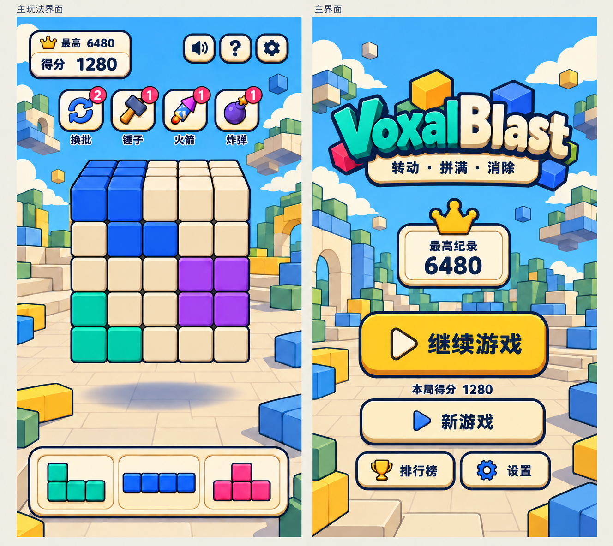
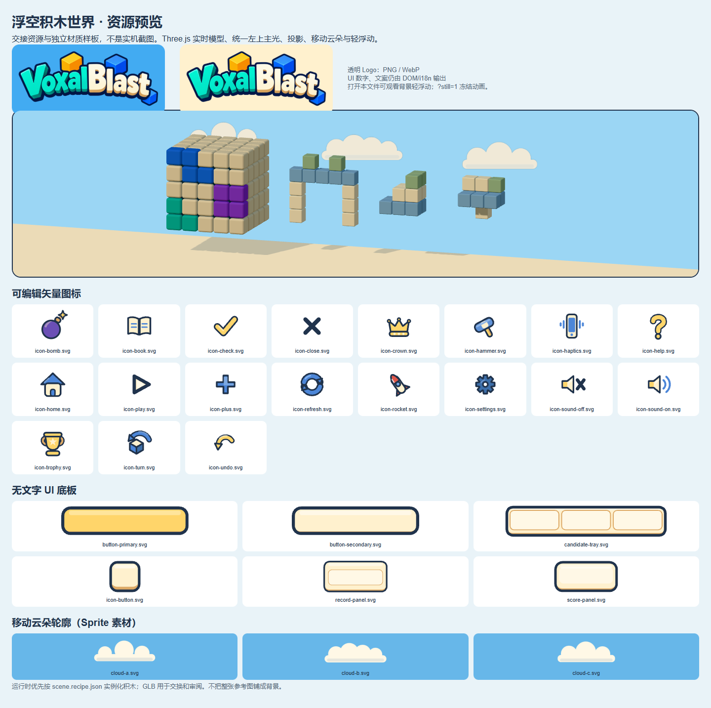

# VoxalBlast「浮空积木世界」美术资源与替换交接单

> **接收人：Jeffy｜美术：Luna｜交付类型：资源包 + 实施方案，尚未接入游戏。**
> 基线：VoxalBlast **v0.12.0 / `5d307a8`**，Three.js r172、postprocessing 6.39 系列；以交接时源码为准。
> 本文是本轮的**唯一交接说明**：方向、资源清单、模型与光影、背景/云/浮动、代码入口、施工顺序、验证边界和复现方法均在这里。不需要查聊天记录。JSON、GLB、SVG、预览页是配套资产，不是另外一套需求文档。

## 0. 先读结论：做什么，不做什么

1. **采用蓝天、奶油色 UI、深蓝轮廓的方块广场 V4。** 不采用复古街机、木质田园、林间灯会或怪物/宠物题材。
2. 世界观一句话：**这是一片由积木搭成的乐园，其中一些积木与建筑片段自然漂浮；玩家操作的六面拼图也遵循这个规律。** 不增加解释性剧情、资源、解锁、经营或关卡系统。
3. 主棋盘、候选块、拖拽块、背景积木均为 **Three.js 实体几何实时渲染**。背景禁止直接铺概念图，也不要把漂浮建筑烘焙成一张平面背景。
4. 云朵可以是轻量的 **透明 Sprite**：本包提供独立云形，运行时让其缓慢平移；不是整屏静态图片。默认不使用体积云或昂贵烟雾系统。
5. 远景积木有轻微错相浮动；主棋盘只有极小幅的闲置上下漂浮，交互时冻结，不自动转向、不影响落点。
6. **主棋盘没有承托底座。** 删去该皮肤中的 DOM 底座和 G1 三维承托原型，保留与棋盘明显分离的地面投影。过去“改善与底座接触”的目标在本方向中不继续执行。
7. 冻结玩法、计分、存档、工具、候选形状及旋转操作；本轮资源不改变这些逻辑。本次交付不升级游戏版本；Jeffy 实装后再按发布流程升级。

### 视觉依据与本轮实物





- [批准方向原图](../Art/floating-world-v1/approved-concept-v4.png)：1328×1184，V4 双屏概念。**不是精确手机尺寸稿**，不可照其外框比例硬塞到 390×844。
- [独立资源预览页](../Art/floating-world-v1/asset-preview.html)：双击本地文件即可打开；内嵌依赖与样例数据，无须起游戏服务器。包含真实 98 格样板、三个 GLB 建筑、光照/投影、云朵移动与浮动。URL 加 `?still=1` 可冻结动画。
- **预览页是资源检查台，不是替换后的游戏**，没有玩法，也未复用正式 GemMaterial/composer。样板相机仅展示几何，不是要修改游戏相机的指令。

## 1. 范围与不可回归项

### 1.1 保留的规则

- 5×5×5 外壳，**98 个唯一物理格**；六面各 5×5，棱角共享。不是 125 格实体填充，不是六张互相独立的棋盘。
- 空格与占用格**同位置、同几何、同厚度**，只是材质/颜色变化。不能放一层凸起彩色筹码。
- 三个候选槽；只旋转整盘，不增加候选旋转按键或魔方分层转动。
- 当前形状池源码为 18 类；不按旧文档的 15 类回退，不因概念图只有四格块而删去五格块。
- 四道具换批/锤子/火箭/炸弹的数量、范围、确认与撤销行为保持；没有新工具。
- 初始空盘、规则版本、共享线去重、连击、排行榜和历史存档语义均不改。概念图里的 `1280 / 6480` 仅为示意，**不能写死**。
- 启动仍直接进入对局，主页仍沿现有流程打开；有存档显示继续/新游戏，没有存档时主按钮为开始且隐藏重复的新游戏入口。
- 正式默认英文、保留中文本地化。图上的中文不是生产文案切图依据。

### 1.2 UI 范围

主玩法与主页为主改范围。设置、帮助、排行榜、Game Over、引导等面板保持信息架构与行为，用同一奶油/深蓝基础样式和本包图标统一外观；**不要借换皮删除控件或改引导入口**。没有新增文字图片，所有文字/角标/分数仍由 DOM + i18n 输出。

## 2. 资源包：逐项清单及使用方式

生产候选目录：[`public/art/floating-world-v1/`](../../public/art/floating-world-v1/scene.recipe.json)。正式引用前缀为 `/art/floating-world-v1/`；若部署在子路径，沿用项目的 Vite base 拼接方式，不自行假设站点根。

**40 个文件：39 个资源/配方文件 + 1 个索引。** 其中 28 SVG（19 图标 + 6 底板 + 3 云源）、3 透明 Logo、3 云 PNG、4 GLB、1 JSON 配方、1 manifest。`manifest.json` 的 `totals.files` 不包含 manifest 本身，故为 39。字节数以随包索引为准，不把文件大小称作显存占用。

### 2.1 品牌（3）

| 文件（相对资源目录） | 实际尺寸 | 用途 |
| --- | --- | --- |
| `brand/logo-512.png` | 512×208 RGBA | 小屏/兼容兜底；保持宽高比 |
| `brand/logo-1024.png` | 1024×416 RGBA | 高分辨率 PNG 源/兜底 |
| `brand/logo-1024.webp` | 1024×416，lossless alpha | 优先的高清首页 Logo |

品牌是批准图中字标的独立重绘，保留 VoxalBlast 拼写、青色/奶油字和少量装饰积木。**不含中文副标题、数字、皇冠或界面。** 原字标与生成图并非像素级一致；最终品牌观感仍可由制作人审阅。

推荐 `<picture>` WebP + PNG 兜底，按实际展示宽度择一加载，不预加载三份。装饰性 Logo `alt="" aria-hidden="true"`，可访问页面标题保留文字 VoxalBlast。

### 2.2 可编辑图标（19，均为透明 SVG，128×128）

| 文件 `ui/…` | 语义与目标位置 |
| --- | --- |
| `icon-refresh.svg` | 换批：闭环双箭头 |
| `icon-hammer.svg` | 锤子 |
| `icon-rocket.svg` | 火箭 |
| `icon-bomb.svg` | 炸弹 |
| `icon-sound-on.svg` | 开启声音 |
| `icon-sound-off.svg` | 静音，替换旧的 CSS 斜杠叠画 |
| `icon-help.svg` | 顶栏问号 |
| `icon-settings.svg` | 顶栏/主页设置，深蓝齿轮 |
| `icon-trophy.svg` | 当前分数/排行榜 |
| `icon-crown.svg` | 最高纪录 |
| `icon-play.svg` | 开始/继续 |
| `icon-plus.svg` | 新游戏 |
| `icon-close.svg` | 关闭，深墨色叉号 |
| `icon-check.svg` | 确认/选中 |
| `icon-undo.svg` | 撤销：单弧单箭头，不替代换批 |
| `icon-home.svg` | 设置中的回到主页 |
| `icon-book.svg` | 设置中的说明/帮助 |
| `icon-haptics.svg` | 设置中的振动 |
| `icon-turn.svg` | 设置中的拖拽转面选项，单立方体+单弧 |

图标只有图形，**没有按钮底板和角标数字**；不要以为文件已包含完整道具键。所有 SVG 为原创可编辑路径，无字体、脚本、外链、内嵌栅格或滤镜。按钮命中区域 ≥44×44 CSS px；小图目标 24–32 CSS px。`icon-bomb` 的火花故意接近边缘，内置留白最小 5 源像素，禁止自动裁透明边。

### 2.3 无文字底板（6）

| 文件 `ui/…` | viewBox | 内容/拉伸约束 |
| --- | --- | --- |
| `button-primary.svg` | 512×128 | 金黄色主 CTA；9-slice 源 inset 56 |
| `button-secondary.svg` | 512×128 | 奶油次按钮；源 inset 56 |
| `icon-button.svg` | 128×128 | 图标按钮底板，等比缩放，不做横向拉伸 |
| `score-panel.svg` | 320×160 | 无数字记分底板，源 inset 56 |
| `record-panel.svg` | 480×240 | 无皇冠纪录底板，源 inset 72 |
| `candidate-tray.svg` | 720×144 | 三个空槽，无候选块；整幅等比缩放，不横向 9-slice |

- 图标瓦片视觉中心在 `(64,58)`，不是 `(64,64)`。128 单位底板上，可把图标以 104×104 放在 `(12,6)`；正式 CSS 按比例缩放。
- 三槽可用区：`x=24…240 / 252…468 / 480…696`，均为 `216×86`，`y=24…110`，槽间 12。候选是真实 Three.js 图块，不能截图烘焙在托盘里。
- `border-image-slice` 为**源图单位**；目标 `border-image-width` 与布局 padding 分开。主按钮建议布局最小 160×56；例如源 slice 56、目标绘制边约 20–24 CSS px，实际按手机文本长度检查。上述 inset 为制作建议，**尚未在正式 CSS 的全部尺寸验证**。
- 更稳的短屏托盘方案：按上述比例，用 CSS 绘制一层奶油外框 + 三个 DOM 槽，沿用三个现有 WebGL 候选 canvas，不新增 canvas。

### 2.4 云（6）

| 文件 | 尺寸 | 使用方式 |
| --- | --- | --- |
| `clouds/cloud-a.svg` / `cloud-a.png` | 512×192 | 可编辑源 / 默认 Sprite RGBA 贴图 |
| `clouds/cloud-b.svg` / `cloud-b.png` | 512×192 | 同上 |
| `clouds/cloud-c.svg` / `cloud-c.png` | 512×192 | 同上 |

云体约占画布 75%–81% 宽，透明边是统一锚点所需，**不得裁掉**。颜色为 `#FFF8E6 / #E7E7DD`，无深黑描边。推荐生产加载 PNG，避免 SVG 解码路径的浏览器差异；SVG 保留给美术编辑。本体可以使用二维纹理，但位置是逐帧变化的；不等于静态背景。

### 2.5 实体模型与配方（5）

| 文件 | 内容 | 使用决策 |
| --- | --- | --- |
| `models/block-unit.glb` | 单个圆角方块，588 三角形 | 交换/查看基准；正式盘面仍用已有 `RoundedBoxGeometry` 同源工厂 |
| `models/floating-arch.glb` | 13 块组成的拱门片段 | GLB 已提供；正式背景优先由配方实例化 |
| `models/floating-stairs.glb` | 12 块组成的台阶片段 | 同上 |
| `models/floating-ledge.glb` | 10 块组成的悬浮台片段 | 只用于侧边远景，不作为棋盘底座 |
| `scene.recipe.json` | 几何、颜色映射、材质、灯光、模型 cell、布局、动画和三档质量参数 | 本轮美术可调参数源；**当前未被游戏导入** |

GLB 为 Y-up，无骨骼/贴图/动画。1 单位对应棋盘一个逻辑格的间距；prefab 原点为配方 cells 减去 `pivot` 后的位置。配方的 `cells` 每项是 `[x,y,z,paletteKey]`：拱门 pivot `[0,2,0]`，台阶 `[0,1,.5]`，悬台 `[0,0,.5]`。

GLB 使用可交换的标准材质，**不包含 GemMaterial、自定义高光或生产阴影系统**。加载 GLB 只作为几何来源时，Jeffy 要替换成共享运行时材质。不要把每个模型节点都保留成独立 draw call，也不要运行时同时加载 GLB 和再实例化一套相同 cell。

### 2.6 索引（1）

`manifest.json` 列出各文件相对路径、字节、SVG viewBox、实际三角形数和交付状态。**不是资源加载器**，现有游戏不会自动读它。

## 3. 统一画法、色板与状态

| 角色 | 色值 | 约束 |
| --- | --- | --- |
| 深色轮廓 | `#20334C` | UI 线稿；不用旧木质棕色 |
| 空格 | `#F4E4C0`，活动面可到 `#FFF1CC` | 无木纹，低光泽，不用纯白曝掉 |
| 缝隙/背壳 | `#243A4A` | 只在接缝中显示，不能整盘变黑 |
| 天空 | 上 `#42ABF2` → 下 `#B8E5F7` | CSS/程序化渐变，非全屏背景图 |
| UI 奶油/主键 | `#FFF1CE / #FFD56A` | 数字和文字仍用深蓝 DOM |
| 地面/远景蓝/绿/黄 | `#E7D6AE / #8CB8DB / #A6C49B / #F1D17A` | 降低饱和度，不能抢棋盘 |
| 主拼块示例 | 蓝 `#2F70E8`、青 `#18BBA6`、紫 `#9454D9`、莓红 `#E65B86` | 清楚区分占用与空格 |

图标中的蓝、红、紫强调色是有意保留，不限为四色；UI 外轮廓约 6/128、内线约 3/128。模型用体积、宽高光、缝隙和受控轮廓表现，不使用随机划痕、木纹、玻璃折射或炫光。

**颜色映射只改渲染**。`referencePalette.js` 的 14 个旧 RGB 身份保留，按配方 `paintMapping` 替换显示色；不要重写 shape 或存档中的颜色。有效落点、非法灰、道具 scope/clear/shared 三种信号保持语义分离，不借换皮把它们涂成同一种颜色。

按钮状态：默认按资源；hover 只亮 1.03 倍；pressed 仅移动视觉面层 1–2 CSS px（大按钮最多 3），**不移动实际 hitbox**；disabled 饱和度 .35、透明度 .55，仍保留 disabled/aria；键盘 focus-visible 用独立 2px 轮廓；active tool 保留现有选择框。动效 100–140ms；reduced-motion 下去掉位移。

## 4. 方块怎么实现：真几何、同源、实时受光

### 4.1 不重建规则盘面

继续使用 `src/rendering/blockResources.js` 的共享几何/材质工厂与 `boardView.js` 的 98 个格；不从概念图识别/导入盘面。首轮保留已经验收的几何：

```js
new RoundedBoxGeometry(0.95, 0.95, 0.95, 3, 0.13)
```

逻辑 pitch=1，所以相邻实体间留 .05 缝；588 三角形/块，不突破既有 ≤1000 门禁。空格、占用、候选、拖拽复用同一 geometry。颜色变化只切共享 material，不 scale、不沿法线抬起，不把彩色块压成贴片。

背壳仍内缩 .68，颜色改为深蓝灰以形成接缝；可保留圆角壳体，不能把壳体误当一个额外的可放置格。禁止背景 GLB 进入棋盘 raycast 列表。

### 4.2 材质起始参数（需实机收敛，不是测量结论）

| 参数 | 空格 | 占用彩漆 | 背景积木 |
| --- | ---: | ---: | ---: |
| roughness | .72 | .58 | .86 |
| metalness | 0 | 0 | 0 |
| clearcoat | .05 | .12 | 0 |
| clearcoatRoughness | .55 | .50 | 不启用 |
| envMapIntensity | .25 | .35 | .18 |
| specularIntensity | .45 | .50 | 标准漫反射为主 |
| ior | 1.40 | 1.40 | 无透射 |

- `opacity=1`、`transparent=false`、`transmission=0`；已有 scatter/internalReflection/coreAbsorption/environmentTransmission 保持 0。
- 去木纹时同时停用相关 albedo/normal/roughness/grain map 的影响，不能只把颜色改成奶油。**roughness 的表值乘旧粗糙贴图后会变味**：首轮使用无纹理的统一粗糙度做 A/B。
- 保留现有 GemMaterial 接入与接口，先把实体彩漆参数调稳；不在同一轮更换整个渲染栈。
- 有光影不等于镜面：正面是一大片稳定色，倒角有一条宽软亮边，背光侧下降一档明度。必须能随着真实翻转改变受光，而不是固定在面上的假高光贴图。
- 轮廓先靠深色缝与背壳。若仍不足，只给**整盘/整组外轮廓**加可控描边方案并计入成本；不要给 98 块每块额外开后处理通道。边线不能比有效落点框更醒目。

### 4.3 背景建模与实例化

背景每块 `RoundedBoxGeometry(.96,.96,.96,2,.075)`，实际 300 三角形。运行时优先读配方 cell，用共享 geometry + material + `InstancedMesh`/instanceColor 组装；13/12/10 块模型只是美术预制体，不是小游戏拼块。

给每个建筑组保留 `baseTransform`，每帧由组的 transform 推导其 cell instanceMatrix；复用 Matrix4/Vector3，禁止每帧 new Mesh/Material。数量很少，允许先单组共享资源实现，再合批；最终背景新增 draw calls 建议 ≤8（不含云），不得以换皮新增几十个材质实例。

各模型为离地片段，必须露出底面与空气间距；混合少量地面建筑、平坦广场和远景漂浮体。不要全部变成“天空岛地图”，也不要把悬浮台摆到棋盘正下方。

## 5. 光照、色彩空间与悬浮投影

### 5.1 同一主光逻辑

| 灯 | 色彩/强度/位置 |
| --- | --- |
| Hemisphere | sky `#DCF1FF`，ground `#E6D3AB`，1.0 |
| Key directional | `#FFF1DC`，1.8，`[-3.5,7,9]`，屏幕左上照向主体 |
| Fill | `#D8EDFF`，.4，`[5,2,-4]` |
| Rim | `#FFF2D9`，.2，`[-4,4,-5]` |

`toyLights.js` 是主场景与候选的统一入口，二者不可各调一套。先保持 exposure=1；环境强度建议 .3，程序化环境的 reflectionKeyIntensity=1.5、reflectionCardIntensity=.6、reflectionRimIntensity=.5、reflectionGlintIntensity=0，防止旧锐利亮点重新出现。不要新增 HDRI 网络下载依赖。

当前主 renderer 是 **NoToneMapping**，末尾 `ToneMappingEffect(NEUTRAL)` 才做一次映射；保持它，不在 renderer 再开 ACES/Neutral。纹理颜色图使用 SRGBColorSpace，HDR 环境保持 LinearSRGB；数据贴图/AO/roughness 不按 sRGB 解码。候选 renderer 仍沿其现有单次映射路径与主画面校准，不能因为主 renderer 的设置而盲目改成双重映射。

### 5.2 主棋盘悬浮：地面固定，阴影分离

- 不使用原 DOM pedestal，也不开 G1 平台。注意 **`platformEnabled:false` 当前只是选择旧 DOM 底座，并不代表已去底座**，相关节点/fitPedestal 路径必须在新皮肤显式停用。
- 地面不随 cubeGroup bob 上下移动。接收阴影的 plane 固定；仅依据棋盘高度/朝向更新阴影。
- 安全下界可按球包围估算：`extent=(gridSize-1)*pitch/2 + blockSize/2 = 2 + .95/2 = 2.475`，等价于现有 `half - cs/2 + blockHalf`；任意姿态保守半径 `sqrt(3)*2.475 ≈ 4.287`。`.02 cell × pitch=1` 即 `.02` 世界单位，加 `.25` 安全余量后下界约 `-(4.287+.02+.25)=-4.557`；本方案再保守取 **`floorY=-4.8`**（pivotY=0），不要照 -4.557 压缩间距。有整体升降时用基准 pivotY 偏置；不要只按静止面底的 -2.475 放地面，否则 45° 中间帧可能切入。
- **High**：一张 1024 PCFSoft shadow map，只优先照顾主棋盘；沿用 bias=-.00015、normalBias=.012、局部阴影视锥 ±4.8 起步。接收阴影 opacity≈.18。背景默认为 `castShadow=false`，不能把 shadow frustum 无限放大导致主盘锯齿。
- **Medium/Low**：保留所有方块的真实法线光照，用一个程序化软椭圆作为悬浮投影，opacity≈.14；不画贴住底面的浓黑 AO 圈。高度升高时投影略放大、略变淡。参考：`scale = base*(1+.10*clamp(h/h0-1,-.5,.5))`，`alpha = base/(1+.25*max(0,h/h0-1))`。
- 实时阴影与软投影同时启用时减半各自浓度，避免叠成黑洞。SSAO 仅为可选高档增强，不是表现体积的唯一手段。

## 6. 背景场景布局：有世界观，不挡操作

`scene.recipe.json` 的 layout 是**布局种子，不是所有视口的最终坐标**。

- anchor 为**整屏 NDC**：左 -1、右 +1、上 +1、下 -1；不是棋盘局部 NDC，也不是世界坐标。
- gameplay 推荐左侧悬浮拱门、右侧台阶、一处低对比远景悬台；home 沿两侧延续这些形状。每组高度约占屏幕 10%–15%，独立散块 2.2%–3%。避免等间距对称贴花。
- 重新布局只在 viewport/安全区/模式变化时运行。用最终整屏 renderCamera 把 NDC anchor 解到指定深度平面，再以投影高度匹配 `screenHeightFraction`；深度必须明确，**不能直接把 NDC z=1 当作装饰物世界位置**。
- 所有背景物体放在主棋盘之后，不挂在 cubeGroup，`raycast` 排除，不能跟着玩家旋转。
- keep-out：主棋盘在停靠与 0°/45°/90° 转动中的屏幕包围盒并集 +24 CSS px；顶部 HUD/道具、底部候选、落子/道具反馈、主页 Logo/纪录/按钮的矩形 +12–24 px。散块/建筑与禁区相交时向侧边退让，仍冲突则隐藏，**不缩主棋盘给装饰让路**。
- 390×844 先保留左右各 1 组；320×740/844×390 可以只留 1 组。宽屏增加留白而非把主盘缩小。任何装饰都不能长得像可以拖动的候选或新增收集品。
- 地面可用一个低复杂度浅色面与少量几何铺装线，远处保留天空；不依赖全屏烘焙图。地面实体与主投影的相机/坐标需一致，不能一层在 DOM、一层在另一透视里互相漂移。

## 7. 云朵移动：Sprite，不是静止贴画

默认 3–6 个云 Sprite，共享本包 3 张 512×192 RGBA PNG。`TextureLoader` 设置 `colorSpace=SRGBColorSpace`，透明材质 `depthWrite=false`、`depthTest=true`，放在建筑/棋盘之后；不要投射动态阴影，不进拾取。全屏天空底用 CSS/程序化渐变即可。

- 速度按**每秒屏宽比例**而不是固定世界速度：`.006 / .008 / .010`，同向轻移，约 100–167 秒横跨一个屏宽；用不同大小/高度形成远近层。
- 允许极轻的 y 浮动：幅度 `.002×屏高`，周期 16s；横移是主运动。
- 云完全离屏且计入自身半宽后才绕回；左右各至少预留 `.2×屏宽`，严禁在可见区突然跳位。
- 使用累计的 ambientTime 驱动，不按帧数累加。resize 后从归一化相位还原位置，不能每次随机重抽。
- 暂停/低性能退化见 §10。不要再为云开独立 rAF、CSS 无限动画和 Three rAF 三套时钟。

参考公式（`x0,w` 为归一化屏宽单位，非 NDC）：

```js
const span = 1 + 2 * margin + cloudWidth;
const x = ((x0 + speed * ambientTime + margin + cloudWidth / 2) % span + span) % span
        - margin - cloudWidth / 2;
```

## 8. 浮动动画与交互安全

| 对象 | 幅度 | 周期 | 旋转 |
| --- | --- | --- | --- |
| 主棋盘 | .02 cell（pitch=1 时即 .02 世界单位） | 5.5s | **不自动旋转** |
| 远景建筑组 | .12 个该组缩放后的 cell | 7.5s | 初版不摆头 |
| 独立远景浮块 | .16 个自身 cell | 6.5s | 最多 ±1.5° 慢摆 |

`y = baseY + A*sin(2π*t/T + phase)`，不同组 phase 按 1.3rad 错开，散块按 1.7rad。围绕固定 baseTransform 求值，禁止逐帧 `position.y += sin(...)` 导致漂移；不改模型内部 cell 相对位置。

### 主棋盘特别处理

1. 用 cubeGroup 的整体平移，不缩放、不逐格动、不混入 quaternion 旋转吸附。现有输入通过 matrixWorld 的局部平面/逆矩阵运算，可容纳平移，但**不等于已证明所有交互安全**。
2. pointerdown（包括转面手势）、拖拽/回弹、道具选中/确认、开场波、翻面吸附、游戏暂停期间冻结在**当前偏移**；不要在按下瞬间归零。恢复用 .25s 连续融合，不能从零相位重新启动而跳一下。
3. 每帧顺序：更新朝向吸附 → 决定并写 bob → `cubeGroup.updateMatrixWorld(true)` → 重算投影/ghost/落点与需要依赖的新世界锚点 → 渲染。输入回调也要读取同一个已更新矩阵。
4. 初次射线/拖拽时锁住 gestureSpan、ghostCellPx 的手势基准，不让浮动引入 1–2px 阈值抖动；pointer capture 结束后再恢复。
5. 粒子出生点按发射瞬间真实 matrixWorld 算；已离开棋盘的粒子保持世界空间，不再随棋盘一起漂。
6. `fitPedestal/fitPlatform` 不得在 bob 后重新把支撑贴回底面；新方向直接关闭这两条支撑路线。阴影地面固定。
7. 截图/探针提供**新增的** ambientTime 固定值、bob=0、seed=74123 控制；不是声称现有项目已经有这些 dev API。生产默认动，测试可重现。

## 9. 工程接入：复用主 renderer，不加第 5 个 WebGL 上下文

### 9.1 已核实的现状

- `gameScene.js:294` 建主 renderer，挂 `#scene-wrap`，尺寸取该区域；`scene.background=null`。
- `pieceView.js:206` 每候选槽有自己的 renderer，当前总计 **4 个 WebGL 上下文**。不得再额外建一个全屏背景 WebGLRenderer。
- 背景现为 `pastoralBackdrop.js` 的 DOM SVG + `<picture>`，在画布后；它不是实时积木。
- `main.js:1627` 为唯一 rAF；`:1641` 主页打开时直接 return，导致主 composer 不运行。
- `postprocessing` 的 `EffectComposer.setSize()` **会调用 renderer.setSize()**。不能以为给 composer 传局部尺寸只会缩小 RT。

### 9.2 选定施工路线：整屏主画布 + 保留交互相机的投影嵌入

这是**待实现并验证的架构方案**，不是本轮已跑通的游戏改造。先单独做此门禁，再加场景内容。

1. 主 renderer canvas 改为 fixed 全屏、`pointer-events:none`，放在 UI 后。保留 `#scene-wrap` 作为原棋盘交互/排版区域，独立透明输入面仍有尺寸、touch-action 与命中能力；输入事件从显示 canvas 改绑该交互面。HUD/模态层不受影响。
2. **canonical camera** 仍服务原 framing、投影测量、手势与拾取，aspect 继续来自 gameplayRect，不改 FOV 6/7、cameraDirection 或翻面距离。新增 `getGameplayRect()` 作为唯一来源，不再从全屏 canvas 读交互矩形。
3. 新建同型 **renderCamera（不是新 renderer）**，每次复制 canonical 的世界矩阵、near/far 等，再将原局部投影嵌入整屏：

```text
W,H = 主画布 CSS 尺寸；gx,gy,gw,gh = 相对主画布的 gameplayRect CSS 坐标
sx = gw/W ; sy = gh/H
tx = 2*(gx+gw/2)/W - 1
ty = 1 - 2*(gy+gh/2)/H
M  = [sx 0  0 tx
      0  sy 0 ty
      0  0  1 0
      0  0  0 1]
P_render = M * P_canonical
P_render_inverse = inverse(P_render)
```

使用 Three.Matrix4.set 的行序列构造 M，再 premultiply；同步 matrixWorld/matrixWorldInverse、projectionMatrixInverse。**不要在最后又调用 updateProjectionMatrix 把嵌入覆盖掉。** 这里是 CSS 坐标比值，不再乘 DPR；DPR 只交给 renderer/RT 尺寸。

`renderCamera.copy(canonical)` 会连 layer mask 一起复制：每次 copy 后显式 `layers.set(0); layers.enable(1); layers.enable(2)`，这是普通 RenderPass 的 mask（主体/阴影接收体/背景）。NormalPass 包装器临时保存该 mask，disable(1)、disable(2)，在 `finally` 恢复；不能永久关闭它们，也不能以为父组设置 layer 会自动传给子 Mesh。

4. 主 Scene 中新增 `floatingWorldGroup`，与 cubeGroup 平级；背景几何放 layer 2，并确保全部子节点设置该 layer。全屏 RenderPass 用 renderCamera，合并同一深度空间；背景在棋盘后，不靠 `renderOrder` 强行盖层。
5. composer 所有 RT 均 full-size，不使用 scissor。RenderPass、NormalPass、EffectPass、SSAOEffect 的 camera 都换为 renderCamera，可在 addPass 后 `composer.setMainCamera(renderCamera)` 统一校准；**setSize 必须在新投影更新之后**，否则 SSAO 会缓存旧 cameraNearFar/projection。`projectionMatches` 调试断言也比较 renderCamera。
6. canonical camera 的 project/unproject 必须配 gameplayRect；全屏 renderCamera 的 project/unproject 必须配全屏 rect，不能混用。装饰布局用后者。
7. NormalPass 现有 layer 1 排除逻辑需操作 renderCamera 并考虑 layer 2；**仅排除 normal 不等于最终 AO 颜色自动排除背景**，High 档需验证深度/normal/合成遮罩是否一致。首轮 Medium 关闭 SSAO，靠正常受光和软投影达标，再单独做 High AO。
8. 不采用“前景画完 clearDepth 再把不写深度的背景铺上去”的做法，它会盖掉前景。也不把 composer 单独缩为 gameplay 大小造成 canvas 又变回局部尺寸。

### 9.3 必改坐标依赖（行号为基线定位线索）

- `gameScene.js`：原 `renderer.domElement.getBoundingClientRect()` 在约 174/214/233/252/419/592/598；全部按用途改为 gameplayRect。resize 区域约 510–524；调试报告约 546–585。
- **`main.js:386` 的 `createGameInput({ canvas: renderer.domElement })` 是事件源，必须改绑保留的 gameplay 输入面（如 sceneWrap）**；同步 `gameInput.js:1601/1605/1623/1627` 附近 pointerdown/wheel 的注册与清理。新全屏显示 canvas 设 pointer-events:none，仅换测量 getter 还不够。
- `main.js:534` 注入 `getCanvasRect`；`gameInput.js` 约 212/463/501/514/534/974/1150；`pieceView.js:81–83,543` 经 getter 的主盘测量，统一改读 gameplayRect。
- 候选自身 renderer 的矩形（`pieceView.js:247–248`）**不改**。
- `getAppliedCanvasSize()` 仍返回原 gameplay 尺寸，用于开场波排序，不返回全屏尺寸。
- 指针只有在 gameplayRect 内才开始棋盘手势；操作区域以外、UI 上的点击不能因全屏 canvas 被捕获。

门禁：将同一格中心投到旧局部区域与新整屏映射，误差 ≤1 CSS px；90° 手势阈值/盘宽比不变；正反面拾取一致。数学映射不代表触控实现天然无回归。

### 9.4 主页、暂停与生命周期

不要只把 `if (homeUi.isOpen()) return` 移到 render 后就继续执行所有 gameplay update。明确分开：

```js
requestAnimationFrame(animate);
if (document.hidden) { resetTimestamp(); return; }
const dt = clampDeltaTo0Through005Seconds();
const home = homeUi.isOpen();
if (!home && !isPaused) updateExistingGameplay(dt);
setGameplayVisualsVisible(!home); // cube + FX，不改逻辑存档
if (ambientAllowed(home, modalState, reducedMotion)) updateAmbient(dt);
updateRenderCameraAndMatrices();
renderAtSelectedQuality();
```

- home 保留背景与云朵慢动，游戏逻辑仍暂停；关闭主页还原原棋盘、候选、姿态和工具状态。
- `effects.js` 的 fxGroup/particleRenderer 当前不暴露，需要增加 `setVisible` 句柄，不能只藏 cubeGroup 而留下消除粒子。
- `#scene-wrap` 不能因 home 导致 resize 读 0 后永远停更。可保持测量层 `visibility:hidden/inert`；或缓存最后有效 gameplayRect，并在 home 用独立背景展示 camera（仍是同一 renderer），返回时重新测量。**不得拿 0×0 做除法。**
- document.hidden：停累计 ambientTime 和实际 render，回来重置时间戳，避免大 dt 飞跃。主页环境目标 30fps，游戏沿现有刷新节奏；不改 deal/scoring 的时钟。
- 模态/广告期间冻结环境，reduced-motion 全部漂移冻结为静止悬浮状态；静止也要保留分离投影。
- 模块提供 `resize / update / setMode / setPaused / dispose`；resize/visibility/matchMedia 监听成对清理。dispose 释放自己拥有的 geometry/material/texture/observer，不销毁与棋盘/候选共享的资源。

## 10. 质量档位、加载与性能边界

| 档位 | 建筑组 / 散块 / 云 | DPR 上限 | 主阴影 | SSAO |
| --- | --- | --- | --- | --- |
| High | 3 / 3 / 6 | 1.75 | 局部 1024 real shadow | 可选，经遮罩与性能验收后开 |
| Medium（首轮默认） | 2 / 2 / 4 | 1.5 | 软投影 | 关 |
| Low | 1 / 1 / 3 | 1 | 软投影 | 关 |

- 与项目现有 quality 选择器合并，不能创建两个互相打架的档位系统。full-size composer 会比旧局部画布占更多显存，必须测实际缓冲尺寸、draw calls、帧耗时和上下文数。
- 背景实例最大全部 35 块 +3散块，每块 300 三角形；约 11,400 三角形增量，不包括地面/云。不得把样板里逐 Mesh 的 draw call 数当生产预算。
- 首屏新增美术网络目标 ≤400 KiB：选一份 Logo、当前需要的 UI、三张云 PNG 与配方。GLB 是交换备份，采用配方实例化时不加载。预览 HTML、概念图、生成源留在 docs，**不拷入首屏资源路径**。
- 降级顺序：关 AO/real shadow → 降 DPR → 减远景组/云 → 冻结环境运动。始终保留主盘实时受光与几何，不退化为整盘图片，不牺牲触控命中。
- 目标手机稳定帧率与具体毫秒预算由实机基线比较；本轮软件渲染预览**不能证明物理手机 60fps**。

## 11. 旧资产替换表与文件入口

| 现有资产/入口 | 新方案 | Jeffy 要做的事 |
| --- | --- | --- |
| `index.html` boot/home 的 `art/ui-redesign/icons/logo-voxalblast.png` | `brand/logo-*` | 保留可访问文字，换图，副标题由 DOM 输出 |
| `pastoralBackdrop.js` 的 `art/reference/valley-landscape.webp / valley-portrait.webp` + inline 场景 SVG | 渐变天空 + 主 Scene 的浮空积木/地面/云 | 停止把旧建筑画面作为正式背景；初载可仅用干净天空兜底 |
| `public/art/pastoral-valley.webp` | 不引用 | 当前 src 无引用，不为本轮重新启用 |
| `index.html` 的 `.garden-pedestal` / `art/reference/pedestal.webp` | 无实体支撑 + 分离投影 | 同步关闭 fitPedestal/fitPlatform 和旧接触视觉，不能只改 CSS opacity |
| `reference.css` 的 `art/reference/score-panel.png` | `ui/score-panel.svg` | 重算文字安全区，清掉旧木棕字/白描边与旧 .1322 顶偏移 |
| `art/reference/settings/help/sound.png` | `icon-button` + settings/help/sound-on/off | 图标与底板分层；静音不再叠旧 CSS 斜杠 |
| `art/reference/refresh/hammer/rocket/bomb.png` | `icon-button` + 对应工具 SVG | 角标/名称独立 DOM，四个按钮行为不动 |
| `art/reference/tray.png` | `candidate-tray.svg` 或同形 CSS 槽 | 重新定位原三 canvas 的有效槽区 |
| `art/ui-redesign/panels/home-record.png` | `record-panel.svg` + 独立 `icon-crown.svg` | 皇冠不再烘焙，纪录数字独立 |
| `home-primary.png / home-secondary.png / home-nav.png` | primary / secondary SVG | 注意 `.home-new` 与 `.home-secondary` 类名不是同一角色 |
| `play-triangle / plus-gold / nav-crown-small / gear-purple.png` | play / plus / trophy / settings SVG | 对应 `index.html` 201–213 一带 |
| `hud-crown-best / hud-trophy-score.png` | crown / trophy SVG | 保留两种语义，不混同 |
| 设置 speaker/vibration/turn/book/home/restart 图标 | sound/haptics/turn/book/home/refresh SVG | 使用行为既有的 row，不增删设置项 |
| 设置/帮助/榜单/Game Over 的旧金边底板 | 奶油 + 深蓝 CSS panel，必要时复用 record/secondary | 不强拉固定三槽图；保留滚动、关闭按钮、动态行高 |
| toggle-on/off、keyboard-hint 旧图 | CSS 圆角轨道/拇指、奶油文字小牌 | 状态继续由既有 class/aria 驱动；不改变可访问性 |

关键工程文件：`src/rendering/{config,blockResources,referencePalette,toyLights,gameScene,boardView,boardShadows,pieceView,pastoralBackdrop,effects}.js`，`src/main.js`，`src/input/gameInput.js`（以实际文件路径核对；搜索 createGameInput），`src/ui/{icons,home,settings}.js`，`src/{styles,toy,reference}.css`，`index.html`。

### SVG/PNG 双叠陷阱（必须处理）

当前 `icons.js` 会注入 `.toy-icon`，`reference.css:43` 又隐藏它；`.item-icon` 的 visibility 继承过去发生过叠画事故。新图建议统一用一个装饰 `` 或一层 CSS image，旧 injected SVG、emoji 与旧 background-image 三者只能保留**一条视觉路径**。不要依靠父节点 visibility 继承猜结果；明确移除旧图或对具体旧子元素隐藏。测试每个图标只有一个可见来源。

按钮底层可用 CSS background；图标用 ``，真实按钮上保留 aria-label。不得把 `` 当按钮而丢失键盘操作。云/装饰只在 Three scene 中，不参与 UI 命中。

## 12. 施工顺序：每轮只解决一个主要问题

| 阶段 | 工作 | 过门条件 |
| --- | --- | --- |
| R0 | 冻结同状态截图、源码基线、draw calls/帧耗时、命中/手势数据；列出旧底座断言 | 能复现同一视口/seed/时间的前后比较 |
| R1 | 单个空格和彩块材质/光照样板；再同步盘面/候选/ghost | 同源、不凸起、不玻璃、不糊格；几何门禁通过 |
| R2 | 去底座与悬浮投影；所有中间翻转姿态检查 | 0/45/90° 无穿插，地面固定，不变手感 |
| R3 | 整屏主 renderer + 投影嵌入；先放一个测试几何，不加动画 | 子视口对齐误差≤1px，framing/drag/swipe 通过，无第5上下文 |
| R4 | 三个真实积木 prefab、天空/地面和云 Sprite，先静态 | 背景不遮挡，主页/局内/短屏均可读 |
| R5 | 云平移与建筑浮动，再加入受约束的主盘 bob | 暂停/后台/reduced-motion/交互冻结与返回无跳动 |
| R6 | Logo/UI替换、英文/中文、设置等面板统一 | 无文字烘焙，无双图标，触控≥44px，长文不溢出 |
| R7 | 多档性能、多尺寸、全回归与证据归档 | 见下方验收清单，再由制作人确认可发布 |

各阶段可独立回退。建议用一个开发期 skin 开关隔离新旧表现，但不改变存档格式；旧图片在全局 grep 无引用且回退策略确认前不要批量删除。

## 13. 验收清单与现有探针需要修改的断言

### 13.1 视口与功能

至少覆盖 `1440×900 / 1280×720 / 390×844 / 320×740 / 844×390 / 2048×900`，英文与中文抽查。具体脚本目前覆盖什么，以脚本列表为准；不把计划视口写成已通过。

- [ ] 98 唯一格、六面共享正确；满行消除/工具/撤销/保存恢复不变。
- [ ] 空格/占用同高；候选、ghost 与盘面同材质，三槽未被背景覆盖。
- [ ] 所有主要翻转轴与中间姿态无底座、无地面穿插，阴影方向合理。
- [ ] canonical → renderCamera 嵌入逐格中心误差≤1px；gestureSpan/盘宽比不变。
- [ ] 拖拽/转面/工具期间主盘 bob 冻结；松手不跳；粒子/落点不漂。
- [ ] 主页进入/退出不更改游戏状态，不恢复第二个主页棋盘副本；背景可以动。
- [ ] 云越界循环无跳帧，decor 不进射线，不盖住 HUD/候选/反馈。
- [ ] hidden 不累时不渲染；reduced-motion 静止；GL context loss/dispose 可恢复或安全降级。
- [ ] 无第 5 个 WebGL context，无重复动画循环，无重复图标；实际资源 404/解码异常为零。
- [ ] 主机与物理手机性能分开留证，不以软件预览或 build 成功代替实机验收。

### 13.2 更新而不是删除旧断言

`tools/screenshot.mjs:370–377` 当前硬断言旧 `.pastoral-backdrop` 与视口等大，约 575–577 又断言 pedestal 接触阴影。新方案必须同轮把它们替换为：整屏主画布、非零 gameplayRect、背景实例数/可见性、cloud texture ready、悬浮间距、无实体支撑、阴影存在等**等价或更强的验收**。

另有 `tools/screenshot.mjs:401 / 614–620`：它读取 `--plaque-board-top`，并与旧 `score-panel.png` 的可见顶边做硬相等断言。替换记分牌时，同轮改为新 SVG/实际渲染顶边及 HUD 对齐测量，不能改了 `.1322` 变量却继续拿旧 PNG 验证。

同时检查 `cube-framing-probe.mjs`、`material-grounding-probe.mjs`、`material-grounding-evidence.mjs` 的底座/相机报告依赖。保留 trianglesPerBlock≤1000 与图标双叠门禁，不能为过测试直接删掉。

环境运动应支持固定 seed/固定 ambientTime/bob=0；另加一组有时间推进的探针，证明云 x 和浮块 y 改变、暂停时不变。静态截图无法证明动画正确。

### 13.3 Jeffy 接入后运行（本轮没有代跑）

```text
npm test
npm run build
npm run shot -- <本地游戏URL> artifacts/visual-floating-world
npm run probe:framing -- <本地游戏URL>
npm run probe:swipe -- <本地游戏URL>
npm run probe:drag -- <本地游戏URL>
npm run probe:item -- <本地游戏URL>
npm run probe:grounding -- <本地游戏URL>
```

各 probe 参数先查该脚本的 CLI 头部；不要因为这里展示统一占位形式就假设所有脚本都用完全相同的参数。修改背景/相机需要 `probe:interaction / probe:ui / probe:churn` 与人工短横屏复测。服务器由实施者按当前工程流程启动，不启动另一份服务冒充线上画面。

## 14. 本轮完成了什么，哪些没有完成

**已完成的资源级工作：**

- 28 个 SVG XML/外部依赖检查；其中原 24 个有 headless 越界/非空检查，后补 4 个有解析包围盒检查，并进入最终资源接触页。
- 透明 Logo 在蓝天和奶油底预览，无需带着色键背景使用；两档 PNG 与 WebP 均带 alpha。
- 4 个真实 GLB，背景三件在独立 Three.js 预览内成功解析并渲染；主样板实际 98 格。GLB 头/版本/大小及配方实例数在静态校验中检查。
- 三个云 SVG 已在浏览器栅格化为透明 PNG；同一预览验证了云位置随时间推进，提供静止截图模式。
- 当前主盘/背景几何实际分别为 588 / 300 三角形；UI 无动态文字烘焙。
- 交付仅新增美术包、独立制作/检查工具、参考与本文，并在文档导航加入口；**没有改 src、index.html、package.json 或游戏运行资源引用**。

**尚未完成：** 正式游戏接入、相机/手势改造、正式 GemMaterial 最终标定、全部质量档、实体手机性能、DPR2–3图标/9-slice全矩阵、正式游戏截图与全量规则回归。独立样板不是这些项目通过的证据。

本轮实测摘要：39 个资源/配方文件共 **830,007 bytes（约 811 KiB，不含索引）**；28/28 SVG 可解析；4/4 GLB 的节点数分别为 1/13/10/12；46 个本地 Markdown 链接可解析；三个制作端 JS 脚本语法检查通过。Edge 独立接触页为 **1440×1433**，样板包含 98 格、3 个建筑 GLB 与 3 朵云；观察窗口内 ambientTime 从 .05s 到 .5273s，第一朵云 x 从 -7.991 到 -7.905086，确认不是静止贴画。样板使用逐 Mesh 展示，其 139 draw calls / 68,722 triangles **不是生产优化成绩，也不是实机帧率证明**。

验证数值/结果保存在配套 `validation.json` 与 `manifest.json`，本文上述结论为其可读摘要；它们不是新增需求来源。

## 15. 文件重建、包结构和交接方法

### 15.1 工作文件

| 路径 | 用途 |
| --- | --- |
| `docs/Technical/FLOATING_WORLD_ART_HANDOFF.md` | 本文，唯一说明 |
| `public/art/floating-world-v1/` | 全部候选生产资产与配方 |
| `docs/Art/floating-world-v1/approved-concept-v4.png` | 唯一采用的美术参考 |
| `docs/Art/floating-world-v1/logo-source-keyed.png` | Logo 原始色键生成源，不可直接接入 |
| `docs/Art/floating-world-v1/asset-preview.html` | 自包含离线检查台 |
| `docs/Art/floating-world-v1/asset-contact-sheet.png` | 本包的实际资源/模型截图 |
| `docs/Art/floating-world-v1/validation.json` | 独立检查台的机器回执，不是实机数据 |
| `tools/art/prepare-floating-world-logo.py` | Pillow 去色键、保留 alpha、输出 Logo |
| `tools/art/build-floating-world-pack.mjs` | 导出 GLB、索引、自包含预览；读取当前 SVG与配方 |
| `tools/art/floating-world-preview.mjs` | 仅美术检查台源，不是正式背景模块 |
| `tools/art/capture-floating-world-preview.mjs` | 独立 Edge/CDP 验证、截图和云 PNG 导出 |
| `tools/art/validate-floating-world-pack.py` | 离线检查资源清单、SVG、alpha、GLB 与文档链接 |
| `tools/art/package-floating-world-pack.py` | 生成保留相对目录的 ZIP，并校验归档及包内链接 |

完整 ZIP 放在仓库 `artifacts/handoff/voxalblast-floating-world-v1.zip`（Git 忽略的交付产物）。解压后保留 `docs/ / public/ / tools/` 相对结构，先打开本文；不要把 docs/Art 下的整屏概念图复制成正式背景。ZIP 为便携交接副本，Git 中的文本与资源文件才是维护源。

### 15.2 复现命令与依赖

依赖已安装的项目 npm 包（Three.js、Vite 所带 esbuild）、Node.js（有 WebSocket/Blob，建议当前项目所用版本）、本机 Edge/Chrome；Logo/离线校验脚本需要 Python + Pillow。无第三方图片 API key，无 CDN，无新 npm runtime 依赖。重建命令在完整项目 checkout 中运行；ZIP 中的独立预览页本身无需这些构建依赖。

```text
python tools/art/prepare-floating-world-logo.py docs/Art/floating-world-v1/logo-source-keyed.png
node tools/art/build-floating-world-pack.mjs
node tools/art/capture-floating-world-preview.mjs
python tools/art/validate-floating-world-pack.py
python tools/art/package-floating-world-pack.py
```

这五个命令重建、校验并打包**本包已知产物**，不触碰正式游戏状态，也不启动游戏服务器。只打交接包时执行最后一条即可。capture 使用自己的临时浏览器 profile，退出后清理，不重启 DSH、不杀用户浏览器。不要在保存页面截图前直接把 `--screenshot` 的首帧当作完成；检查台等待模型与云贴图就绪。

UI SVG 由明确几何原创绘制，源文件即可编辑；生成器不会覆盖它们。修改云 SVG 后跑 build + capture 以同步 PNG；修改 JSON 后跑 build + capture 以同步 GLB 和预览；修改 Logo 源才跑第一条。此处没有重新生成在线 AI 图片的隐式步骤。

### 15.3 Logo 生图来源、提示词与透明处理

原生 `images/edits`，参考本包 V4 双屏图右侧品牌。只调用一次 Logo 生图，未批量生成图标。请求 high / 1536×1024，工具实际 **1942×809 / low**，所以不把请求值冒充实物尺寸。其后做纯色键去除、去边污染与两档缩放。Logo 不含第三方品牌素材；AI 结果仅作为本项目品牌美术，发布前仍应按团队品牌审查流程确认。

最终提示词（保留在本文，重新生图不需要找聊天）：

> Create ONE production-ready isolated game brand wordmark asset redrawn faithfully from the RIGHT HAND VoxalBlast logo in the supplied reference image. NOT a UI mockup. Exact text: VoxalBlast (capital V and B, all remaining lowercase). Match reference chunky rounded friendly toy letter silhouettes, large tilted V, compact lowercase oxal, large B followed by last, playful subtly asymmetrical arched/rising arrangement. 'Voxal' vivid turquoise/teal; 'Blast' warm pale cream. Consistent thick very dark navy-blue outlines, modest dark bottom extrusion, broad restrained cel highlights, crisp clean smooth edges. Retain only a few attached decorative toy cubes in yellow and royal blue: yellow cube above middle-left, royal blue cube above middle-right and smaller blue cube near bottom-right, styled like reference with navy outlines and flat cel-shaded faces. No pink/red cube, no green cubes. REMOVE Chinese subtitle completely and REMOVE cream subtitle plaque completely. No other text, crown, scenery, interface, score, buttons, clouds, icons or old scene shadows. Single isolated logo only on perfectly uniform flat HOT MAGENTA background exact RGB (255,0,255), #FF00FF; this same exact magenta must fill all letter counters and openings. No magenta inside any legitimate logo color. No gradients in background, checkerboard, vignette, environmental cast shadow, ground or border. Wide horizontal canvas approximately 2.4:1, logo centered and occupying canvas with at least 6 percent empty margin on all sides, including all decorative cubes and outlines. Full-resolution sharp PNG logo graphic. Preserve approved right-hand reference brand identity closely; no angular retro arcade styling, no orange text, no glossy chrome, no elaborate textures. Output exactly one logo.

### 15.4 预览页的第三方许可

独立预览页自包含了项目已安装的 Three.js 及其 addons，随交付保留以下许可证（取自当前 `node_modules/three/LICENSE`）。本包没有捆绑竞品图片或字体；新增 UI/云为原创路径，GLB 来自本包配方与 Three.js 几何算法。后续修改/再分发预览时仍保留此声明。

```text
The MIT License
Copyright © 2010-2024 three.js authors

Permission is hereby granted, free of charge, to any person obtaining a copy
of this software and associated documentation files (the "Software"), to deal
in the Software without restriction, including without limitation the rights
to use, copy, modify, merge, publish, distribute, sublicense, and/or sell
copies of the Software, and to permit persons to whom the Software is
furnished to do so, subject to the following conditions:

The above copyright notice and this permission notice shall be included in
all copies or substantial portions of the Software.

THE SOFTWARE IS PROVIDED "AS IS", WITHOUT WARRANTY OF ANY KIND, EXPRESS OR
IMPLIED, INCLUDING BUT NOT LIMITED TO THE WARRANTIES OF MERCHANTABILITY,
FITNESS FOR A PARTICULAR PURPOSE AND NONINFRINGEMENT. IN NO EVENT SHALL THE
AUTHORS OR COPYRIGHT HOLDERS BE LIABLE FOR ANY CLAIM, DAMAGES OR OTHER
LIABILITY, WHETHER IN AN ACTION OF CONTRACT, TORT OR OTHERWISE, ARISING FROM,
OUT OF OR IN CONNECTION WITH THE SOFTWARE OR THE USE OR OTHER DEALINGS IN
THE SOFTWARE.
```

## 16. 交给 Jeffy 的第一步

**先打开资源检查台并读 R0–R3；不要先把整屏概念图铺到页面，也不要直接把主 canvas 改成全屏。** 从共享方块材质与悬浮投影开始，用本包资源替换视觉，不改玩法。通过同源/翻转/输入门禁后，再铺开真实 3D 背景与环境动画。
