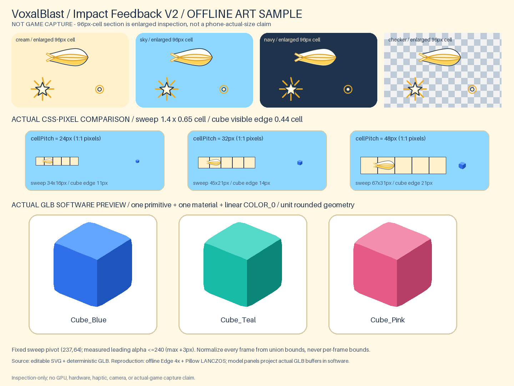
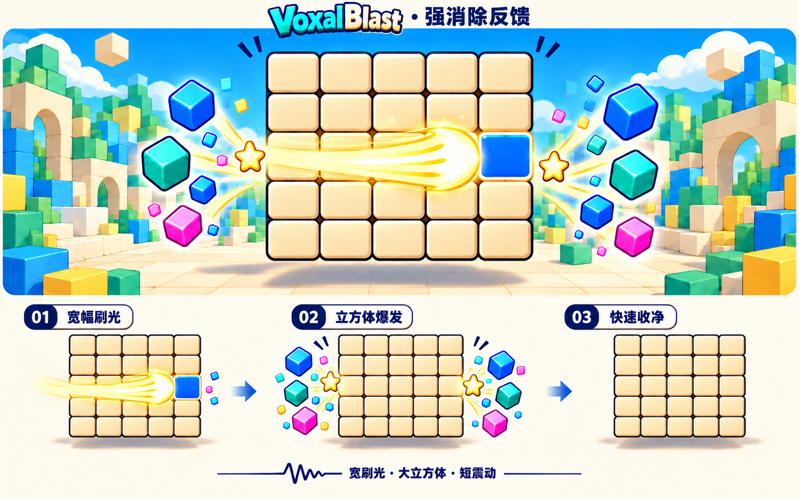

# 落点驱动强化消除、点击与震动｜Luna → Jeffy

> **状态：本轮制作资源并交付实施方案；不是游戏已接入或真机已验收。**
> 核对基线：`0.13.3 / 111d4f8dcc13e51b516b0f365d5a4629e8736250`。工作区已有他人的 `public/__three-probe.html`，不修改、不提交。本轮不改 `src/`、`public/`、游戏规则、存档或版本号。
> 用户已确认：更强的行内刷光与六面体粒子；刷光由**实际放置位置**向外传播；增加默认点击反馈；震动范围为**镜头震屏＋支持设备的触觉震动**。
> [可转发给 Jeffy 的在线入口](https://github.com/PPZ-Game-Life/VoxalBlast/blob/main/docs/Technical/PLACEMENT_IMPACT_FEEDBACK_HANDOFF.md)

## 0. 接管范围与优先级

**目标：让玩家看见“这一手落在这里，因此光从这里传出去”，而不是小碎屑配一条细线。**

- 本文替换[前版卡通消除交接](CARTOON_CLEAR_VFX_HANDOFF.md)中正常消除的尺寸、刷光、起点、时间与震动目标。前版已在v0.13.3接入，历史证据见[实施回执](CARTOON_CLEAR_VFX_ROUNDS.md)，不要再次从零实现旧规格。
- 保留前版物理线去重、面footprint、layer3隔离、质量分档、作用域与真实结算先行等有效结构；保留已有方片图集作为辅助。
- 正常落子/消除的镜头与触觉反馈按本单**统一仲裁**，替换相应旧触发，不额外再叠一套。奖励事实、声音仲裁与短签仍服从[计分奖励交接](SCORE_REWARD_SIMPLIFICATION_HANDOFF.md)。
- 不改规则、分数、发牌RNG、98格实体、占用色身份、相机取景、手势阈值、音频资产、道具和纪录演出；不自动转面、推近、全屏闪白或炸碎棋盘。
- 新设备振动不是保证硬件可感知；用户开关优先，能力不足静默降级。

## 1. 资源与设计参考

- [正式资源说明与加载契约](../assets/impact-feedback-v2/ASSETS.md)
- [运行资源目录](../assets/impact-feedback-v2/runtime/)、[可编辑源](../assets/impact-feedback-v2/sources/)
- [离线动效样片](../assets/impact-feedback-v2/motion-sampler.webp)、[完整帧检查板](../assets/impact-feedback-v2/contact-sheet.png)
- [反馈参数配方](../assets/impact-feedback-v2/runtime/feedback.recipe.json)
- [文件清单](../assets/impact-feedback-v2/manifest.json)、[离线检查](../assets/impact-feedback-v2/asset-checks.json)
- 构建/校验入口：`tools/build-impact-feedback-assets.py`。

| 可加载文件 | 用途与固定契约 |
| --- | --- |
| `runtime/sweep-right.png`＋`.json` | 1024×128、4个256×128形状帧；按每个传播分支的travelProgress选帧，不用固定时长横扫整屏 |
| `runtime/endpoint-pop.png`＋`.json` | 768×128、6个128×128帧；一次性140ms爆点 |
| `runtime/tap-feedback.png`＋`.json` | 512×128、4个128×128帧；一次性160ms点按确认，静态帧用于减少动态效果 |
| `runtime/cube-blue.glb` / `cube-teal.glb` / `cube-pink.glb` | 三个可直接加载的真3D圆角六面体；每色单primitive＋线性vertexColors、中心pivot、1×1×1名义尺寸 |
| `runtime/cube.glb` | 蓝色默认别名；不要与cube-blue.glb重复下载 |
| `runtime/feedback.recipe.json` | 正式交付的待调优尺寸/时序/预算/震屏曲线/触觉pattern，不包含任何直接vibrate调用 |





**读图限制**：参考图只定宽刷光、大六面体、端点爆点的方向；图中左→右方向已被本单的落点双向规则取代。图片里粒子有意夸张，不作为精确计数/投影比例。不从概念图抠资源，不把它当游戏背景。[原图出处及边界](../assets/impact-feedback-v2/references/README.md)。

正式资源是预先制作的贴图/序列、模型与配置。程序只负责事件、姿态、进度、裁切、预算与回收，不能再用细线代替刷光图形。离线动效样片只验证资源与节奏，不是游戏录屏、GPU性能或手机触觉证据。

## 2. 当前实现事实：先修入口，再接新素材

行号是本单基线定位辅助，后续优先按函数名查找。

| 入口 | 当前事实 | 本轮接法 |
| --- | --- | --- |
| `gameInput.js:797–850` → `main.js:onDrop` | input交出预览实际使用的`{piece,face,cells,origin}` | 用这组数据构造实际落子快照，不用手指屏幕坐标猜落点 |
| `board.js:99–120`、`gameSession.js:311–392` | Board用`faceLattice`写格后直接删消除union；settle没返回placedCells/原色快照 | settle之前只读快照，settle之后只消费真实lines；不改Board返回或存档以迁就动画 |
| `cartoonClearPlan.js:25–142` | physicalLines去重，faceFootprints保留；已有first/last/axis | 扩展每物理线的originT与左右传播距离；不能把现有端点发射器当放置起点 |
| `effects.js:1155/1158/1186/1229` | `lerp(range,t)`要求数组，却收到arc.minLength、arc.maxLength、dot.maxSize三个scalar | **R0先修NaN**；从真实min/max配对取样并加finite断言，不靠新贴图掩盖 |
| `effects.js:1296+`、`config.js:953+` | 当前所谓outline是沿整行的窄条；没有沿格面移动的宽刷光 | 原窄条降为低调确认，新增有形状的扫光；不能只增大line width |
| `effects.js:1701–1758`、`main.js:1198–1211` | `triggerRewardShake(px,ms)`走worldPerPixel转换，但当前只存scalar并立即触发；clear event key到`spawnCartoonClear`内部才创建，新拖拽会取消现有pulse | 复用唯一相机偏移出口，新增按event key仲裁的待触发记录与确定曲线；不另建CSS整页shake，不把旧scalar正弦误称为已满足新规格 |
| `platform/haptics.js:22–62`、`effects.js:1761–1767`、`main.js:1193–1201` | `hapticsSupported()`当前只决定设置行是否可用；实际`playHaptic()`只读用户偏好后调用封装，每成功落子已有一次haptic。仅`hapticsSupported()===false`不代表当前调用为0，桌面可暴露API并接受调用但硬件no-op | 保留一次成功事件只选一个pattern；新增显式“方法不存在则不调用”的guard。偏好OFF或方法不存在时pulse调用0次，不以mobile heuristic阻断已有API调用，也不新增第二次vibrate |
| `settings.js:48–70,185–190` | haptics缺键默认ON，getter实时读取；`hapticsSupported`用于设置行置灰与说明，不是玩法调用门 | 保留既有开关、持久化与设置行语义；普通点击仍不触发马达 |

代码层已补偿旧图集alpha留白；小粒子不应继续归因于贴图留白。现状样式偏弱与弧光NaN是不同问题，要分别验收。

## 3. 落点快照与颜色覆盖

### 3.1 在合法onDrop里、settle之前取一次

```text
placement = {
  face, origin: copy(origin), localCells: copy(cells),
  placedCells: cells.map(([u,v]) => faceLattice(face,u+origin.u,v+origin.v)),
  color: piece.shape.color
}
paintLookup = clone(board.occupied() -> Map<"x,y,z", logicalColor>)
将placement.placedCells及其color合并到paintLookup
settled = 原有settlePlacement(...)
成功且有清线：把placement + paintLookup中cleared union的颜色 + settled.lines交给FX
失败：全部丢弃；不触发成功脉冲、消除、震屏或成功触觉
```

- 最多98个旧格，只读克隆不保留可变对象引用。**必须合并本次拼块**，否则刚放下即清除的格没有颜色；不得从结算后的Board/mesh猜原色。
- 仍然原顺序结算、更新棋盘、声音/短签、保存；不等刷光才删除格或更新分数。
- 颜色快照不入Board/存档；显示色沿用当前paintMapping/boardView映射，不直接把逻辑RGB当新版材质色。

### 3.2 “刷到哪里，颜色退到哪里”是表现覆盖

真实盘面立即变为空格；临时paint echo只覆盖本次清掉的面格，并随扫光前锋撤掉，最长不超过200ms。使用独立共享材质/实例，不改真实实体材质、geometry或transform。

- 同一物理格只有一个颜色身份；最多98个身份。paint echo只展开到本次`faceFootprints`真实报告的面，不因一个棱/角实体的`tile.userData.faces`存在其它邻面就伪造额外消线；展开后最多150个面格。
- echo实例键固定为`(physicalCellKey, footprintFace, tone)`；`tone`使用`blockResources.toneIndexFor(x,y,z)`这一现有确定性规则。独立颜色解析器按`logicalColor + tone`缓存映射后的色值，使用共享透明echo材质与instance/vertex颜色合批；不得为每个色值新建一套材质/drawcall。只读复用现有映射，不直接修改、降opacity或dispose棋盘正在使用的缓存`paintMaterial()`；视觉与drawcall两道门都要过。
- 交叉格被任一正确波前扫到即撤掉，不能等第二条线再盖回去；共享棱两面复用同一份physical propagation进度，各自在对应footprint上显示，不为每个面重算速度或到达时刻。
- 新拖拽、工具瞄准、新放置、转面、scope取消时立即撤paint echo，绝不盖住ghost或新内容。
- 使用cube-local独立覆盖组或逐帧正确更新world矩阵；不能把现有world-space粒子组整个改挂cubeGroup。
- 缺颜色快照时允许仅扫空格并报`paintEchoFallback`，不能伪造颜色；这只作为兼容/失败兜底，**不算完整视觉验收通过**。

## 4. 每条物理线的双向传播规则

对排序、去重后的每条physicalLine：

1. `hits = placedCells ∩ line.cells`；合法正常落子产生的消线，hits必须非空。
2. 沿该线单位轴投影hits，取平均得到`originT`；多个新格只产生**一个**起点，不是每格一团光。`originT`是连续标量，非连续hits的中心可以落在一个未被本手放置的格上；实现不得假设起点本身一定属于placedCells。
3. `originWorld`由同一晶格/棋盘变换对连续`originT`求出；不是pointerup、piece屏幕中心或随机交点。
4. 以线内下标`0..4`表示5个格中心，负端外边界固定为`-0.5`、正端外边界固定为`4.5`：`dMinus = originT - (-0.5)`，`dPlus = 4.5 - originT`，两者均非负。
5. 从同一个起点建立正/负两条face-local波前，以**相同的32格/秒**向两端推进。到达式固定为`arrivalMs = 35 + distanceCells / 32 * 1000`；多个faceFootprint只复用这一份lattice标量进度绘制表面实例，不按面重算速度。两边不强制同时到达。
6. 某端到达时触发该端可获分配的爆点/六面体；方向沿该端向外。零长度段不发第二次重复爆点。

可复算示例（`start=35ms`、`speed=32格/秒`）：

| hits | `originT` | 负端到达 | 正端到达 |
| --- | ---: | ---: | ---: |
| `[2]` | 2 | 113.125ms | 113.125ms |
| `[0]` | 0 | 50.625ms | 175.625ms |
| `[0,1]` | 0.5 | 66.25ms | 160ms |

5格线最长传播在200ms内结束。居中落子两边同时到，靠端落子近端先到、远端后到。终点时间由距离计算，不通过另设左右速度假装同时完成。纯planner必须增加非连续hits用例，证明centroid可以不在placed格；该人工纯函数用例只验证数学边界，**不宣称当前一定存在一个合法拼块能在一次落子中覆盖整条线的两个离散端点**。

### 4.1 多线、交叉与跨面

- 平行多线各取自己的hits起点，同一落子同时启动，不排队。
- 交叉线分别传播，起点可以不同；交点不额外强制当起点。重合亮度取max/有限覆盖，不把两层alpha相加成白块。
- 同一共享满棱两面报告：只有一份physical propagation/预算身份，面footprint仍两面显示，端点装饰按坐标去重。
- 跨面分别沿各自平面轴走，贴面遮挡真实；不穿过立方体内部，不转镜头“展示背面”。
- 异常旧fixture/导入状态出现hits为空：DEV报告明确失败；生产兜底用线中心且标`originFallback`。不能把兜底当合法落点覆盖已验收。
- 规划是纯函数；不读取随机发牌状态，不二次计分，不为了视觉修改lines。

## 5. 正式表现与预算

### 5.1 资源分工

| 层 | 视觉要求 | 表现方式 |
| --- | --- | --- |
| 落点脉冲 | 一个短奶油色确认，强调“这一手” | 单次局部提示，不按新格数量倍增 |
| 宽刷光 | 有明确光头、金边、分叉柔尾；可见高度约0.65格、长度约1.4格 | 加载正式扫光贴图，按face-local轴前进，头部pivot与方向绑定 |
| 端点爆点 | 到端点才展开再收净，总时长固定140ms | 读取正式一次性序列，不循环，不把不同形状当连续帧 |
| 六面体 | 可见边约0.36–0.52格，有倒角与三面体积 | 单primitive、vertexColors的预制GLB实例化；前45%寿命保持体积，再收缩退场，不使用0.13格小方片冒充 |
| 辅助方片 | 小量蓝/青、少量粉，衬托主粒子 | 复用旧图集，不重新加载两份全套贴图 |
| 点击反馈 | 小点＋小圈，不像消除成功；总时长固定160ms | 独立tap资源与输入作用域，见§7 |

贴图“可见尺寸”按clip级`unionAlphaBounds`换算，不按透明tile外框。每个序列clip先求全部帧alpha的union，以这一块固定矩形完成统一归一化、pivot和quad尺寸；单帧`alphaBounds`只作检查，**禁止逐帧平移/缩放补偿**，否则会抵消爆点、tap本应存在的扩散/收缩。扫光资源目标为真实可见比例约`1.4×0.65格`，按clip固定参考框与JSON的世界尺寸合同建立非正方形quad，不能仅套一个BillBoard标量size把宽光头压成细条。旋转/镜像绕clip元数据pivot，不围绕整图透明边缘猜中心。

GLB的`visibleEdgeCells`按模型**局部未旋转的1单位包围盒边长**换算，缩放为`cellPitch×visibleEdgeCells`；旋转后的屏幕AABB会随姿态变化，需另报真实CSS像素，不逐帧按投影框反向缩放，否则会产生不自然的体积呼吸。离线检查板的像素靶标不替代游戏相机下的投影尺寸验收。

- 双向扫光用同一正向资源的镜像/旋转，不另烘焙不同棋盘角度。3D表面采样需正确法线与遮挡，不能用永远朝屏幕的beam代替贴面刷光。
- 每条传播分支的扫光尾部必须同时裁到`originT..frontT`已经传播过的轴区间，并裁到该`faceFootprint`的真实面格mask；起始瞬间不能把完整1.4格柔尾摆在origin两侧，从而越过源点或提前覆盖front尚未到达的格。镜像分支使用同一规则，只改变传播符号。
- sweep序列帧由该分支的`travelProgress = clamp(travelledCells / max(branchDistance, ε), 0, 1)`选择；不得给所有长短分支固定205ms动画。分支到端点时取最后一帧并结束，视觉帧进度与同速空间前锋保持同一时钟。
- 色覆盖只沿清除格面，间隙与非目标格不被白色涂满；亮头可局部更亮，但禁全局曝光/Bloom增益救画面。
- 前版的360/420ms与140ms发射截止不再是本轮目标。新配方单线420ms、多线480ms前收净，扫光与paint echo≤200ms，剩余时间用于有体积的端点弹出。

### 5.2 按physicalLineCount分配，而非level/raw face数

| 物理线数 | 标准：六面体 / 爆点 / 辅助sprite | 低配：六面体 / 爆点 / 辅助sprite |
| --- | --- | --- |
| 1 | 4 / 2 / 6 | 2 / 1 / 2 |
| 2 | 6 / 4 / 8 | 3 / 2 / 3 |
| 3+ | 8 / 6 / 10 | 4 / 3 / 4 |

这些是**每次事件总数**，不是每条线/端点数量。计数单位固定：一个“六面体”是一个活跃GLB实例；一个“爆点”是一次完整序列播放实例而不是序列帧数；一个“辅助sprite”是一个活跃billboard实例。先做物理端点去重，再稳定轮转分配，尽量覆盖不同物理线；预算不够时剔除辅助装饰，不取消真实消线确认。

- 最多2个clear事件；全局六面体16/8、爆点12/6、辅助sprite20/8。第三次到来清最旧视觉尾效，绝不丢旧结算/短签/声音。两事件上限与每事件3+档相乘一致，report仍要同时给出事件内分配与全局live，不能只靠数学上“应该相等”。
- 刷光、paint echo与tap独立统计，不混入装饰数后声称“没超”。一个`face-ray`定义为“一条faceFootprint上的一个传播方向”；一条共享棱physicalLine若保留两个面footprint，正/负方向合计4个face-rays，但只共享一份physical propagation进度与预算身份。六面最多60条raw行列×2方向＝每事件120条有向face-rays上界。
- paint echo按活跃`(physicalCellKey, footprintFace, tone)`面实例计数；tap按活跃tap事件计数。旧道具/纪录继续分项，不能把序列帧数、系统对象数或已结束但尚未prune的记录冒充live。
- 所有真实面线保留确认，批量绘制；特殊全盘清除可能非常密，重合alpha必须封顶，不靠把一半消线删掉来降亮度。
- reduced-motion：0飞行、0移动扫光、0镜头震屏；清除面格用≤120ms静态确认，paint echo立即撤，分数/声音/触觉各遵独立偏好。
- 低配仍用宽刷光和有体积主粒子，先减数量，不把主粒子缩回小碎屑。低配主六面体默认只分配蓝/青两个vertexColors变体，粉色让位；避免三种颜色拆成额外材质批，守住低档额外draw calls≤6。加载或能力失败时只允许退回现有v1小方片等明确旧能力，不存在也不得编造“包内2D cube fallback”，更不能拿旧方片绕屏幕旋转冒充真3D翻滚。

## 6. 镜头震屏＋设备触觉：一个落子事件，一次仲裁

参数源：[feedback.recipe.json](../assets/impact-feedback-v2/runtime/feedback.recipe.json)。以下数值是制作与实机调优起点，不是已测手感。

### 6.1 镜头震屏

| 事件 | 最大屏幕位移 | 时长 |
| --- | ---: | ---: |
| 普通点按/无消除放置 | 0 | 0 |
| 单线消除 | 1.2 CSS px | 90ms |
| 双线消除 | 2 CSS px | 110ms |
| 三线及以上 | 3 CSS px | 140ms |

归一化波形：`(t,value) = (0,0),(.12,1),(.28,-.55),(.48,.28),(.72,-.1),(1,0)`；按时间线性插值。沿一个由event key稳定派生的屏幕平面单位方向作用，峰值不是x/y各自都取3px；结束严格回零。同一event key在同一姿态下方向可复现，不用`performance.now()`正弦随机出三轴轨迹。

- 当前`main.onDrop`在`spawnClearEffects`之前立即调用`triggerRewardShake`，而clear event key进入`spawnCartoonClear`后才创建；这只是旧入口，**尚不具备**“按端点到达调度并按event key合并”的能力。
- 接入时先完成clear plan并取得本地`eventKey`、各端`arrivalMs`和第一个可见且获分配端点；再生成唯一待触发shake记录。建议记录形状为`{ eventKey, startAt, px, ms, directionCss, keyframes, token }`。若无可见装饰端点，`startAt`使用计划最早物理端点到达时刻。owner/token与队列都是**待实现合同，不是当前已有能力**。
- 待触发记录由effects的现有wall-clock frame update释放，不建散落`setTimeout`。新拖拽/已认领转面、取消scope、hidden、设置暂停或reduced-motion动态开启时，使token失效并把当前偏移立即归零，旧回调回来不得补震。
- 现有reward shake与本次clear shake按同一event key先仲裁再入队：幅度取较强者，时长取较长但仍受该最终类别上限约束，不把两条曲线相加。幅度相同则按更长时长；幅度、时长仍相同则优先clear规划的稳定方向。若奖励将来需要不同方向签名，也只能在这里确定一条最终曲线。本单clear上限3px、140ms；不得借叠加奖励绕过。
- 复用`worldPerPixel`与现有effects相机偏移出口，但必须替换当前只存scalar、由`performance.now()`正弦写x/y/z的旧曲线实现；“复用出口”不等于旧`triggerRewardShake(px,ms)`已经满足新规格。不要改FOV、相机距离、目标点、停靠角度或投影嵌入矩阵；DOM分数/按钮不跟随震屏。
- 当前主循环恢复canonical pose→应用shake→派生renderCamera；接入后检查手势标尺/拾取误差，不能声称“视觉变化一定不影响输入”。

### 6.2 设备触觉

| 成功事件 | `navigator.vibrate`候选pattern（ms） |
| --- | --- |
| 普通屏幕tap | 不调用 |
| 无消除落子 | `[6]` |
| 单线 | `[12]` |
| 双线 | `[18]` |
| 三线及以上 | `[14,20,14]`（震14、停20、震14；总48ms） |

- 继续使用`platform/haptics.js`封装与实时设置getter。当前缺键默认ON的语义不变。**现状澄清**：`hapticsSupported()`只控制设置行置灰/说明；实际`playHaptic()`只由用户偏好门控，然后调用平台封装。仅`hapticsSupported()===false`不能推导当前调用为0，桌面stub可暴露`navigator.vibrate`、返回true但硬件no-op，mobile heuristic不应被误接成玩法调用总闸。
- 本轮在统一haptics出口新增显式no-method guard：`typeof navigator.vibrate !== 'function'`时不发平台pulse；因此硬断言是“偏好OFF pulse=0、方法不存在 pulse=0、不合格输入 pulse=0”。方法存在但`hapticsSupported()===false`时允许现有调用继续到平台并静默no-op，不能断言调用数为0。
- **onDrop已经有一次触觉调用**。必须在那里仲裁正常落子/消除/奖励，只选择一个最终pattern；不在FX端点回调再发。触觉在结算确认时立即请求，不为和80–180ms后的爆点完全对齐而依赖延时硬件调用。
- clear/reward冲突按单次事件优先级统一选择，clear目标采用本表；已存在的道具/纪录等独立事件不得被误改。连续真实落子允许新的确认替换旧短pattern，不在手势过程中补播过期pattern。
- hidden、暂停、主页、局终、重开、触觉开关OFF时通过统一haptics出口取消**仍活动的**pattern（方法支持时`vibrate(0)`）。为避免每次转场盲调0，需新增唯一haptic owner跟踪`pulseToken / activeUntil / lastPattern`；该owner/token是待实现合同，不是当前已有状态。诊断把`pulse`与`cancel`分型，cancel不算第二次成功反馈。
- `navigator.vibrate`的pattern只能表达毫秒级“震动时长/间隔”；Web API不能指定硬件频率Hz、振幅或马达波形。本文不得用“更强振幅/更高频率”描述两个pattern的差异，强弱只作为设备相关的目标体感并以真机记录为准。
- reduced-motion关闭运动，不擅自关闭独立触觉偏好；声音静音也不自动改触觉。用户可独立关闭震动。
- 异常/返回false静默降级，不弹“请授权震动”、不重试马达、不用音效冒充触觉。

### 6.3 浏览器与平台边界

MDN将Vibration API标为有限可用，需用户激活，硬件/浏览器/系统设置可能忽略请求。仅检测方法存在或返回true，均不证明用户感受到振动。

- Android Chrome、微信/X5、CrazyGames嵌入容器须分别实机验；不能由顶层网页测试推断跨源iframe可用。
- iOS/Safari/WebView没有可靠支持时无触觉是合格降级，不做非标准复选框等伪触觉hack，不申请无关权限，不调用假想CrazyGames haptics API。
- 项目历史的桌面stub/跨源调用读数只证明接线，不能当马达/嵌入权限证据；现行`KNOWN_GAPS`已保留Android未真机边界。
- 来源：[MDN Navigator.vibrate](https://developer.mozilla.org/zh-CN/docs/Web/API/Navigator/vibrate)、[CrazyGames SDK Game接口](https://docs.crazygames.com/sdk/game/)。上线前按当时文档与真机复核，不把本文当浏览器永久支持表。

## 7. 点击点反馈：由输入仲裁，而非全局click

默认在游戏自己拥有的棋盘/空白玩法面开启；不覆盖候选、道具、按钮、文本框、链接或平台广告层。已有按钮`:active`/selected反馈不重复叠环。键盘操作保留自己的焦点/激活反馈，不伪造(0,0)触点。

tap资格状态的唯一owner必须是`gameInput`；`src/ui/tapFeedback.js`如新增，只消费`showDot / confirmRing / cancel`绘制命令，不自行订阅document并维护第二份手势状态。该owner与回调均为**待实现合同，不是当前已有能力**。

1. primary pointer且左键/正常触摸的pointerdown：`gameInput`建立`pendingTap={pointerId,startX,startY,startedAt,token}`并命令原位置显示小点，最多60ms；装饰层`pointer-events:none`，不改变capture/default行为。
2. canvas上的同一次pointerdown当前也会立即建立`viewDrag`，但此时只是“等待定轴”，不等于转面已认领。现有`hasViewGesture()`从按下就为true，不能直接拿它取消pendingTap，也不能直接塞进effects的busy getter，否则小点会在创建当帧自取消。
3. view达到现有16px/主方向比或44px硬锁并真正claim轴、piece越6px进入active、item越各自slop进入dragging、滚动或其它owner认领时，由`gameInput`使tap token失效并发一次`cancel`；同一认领信号再通知clear反馈退出。不得靠渲染模块反猜阈值。
4. 输入系统确认仍未认领为拖拽/转面/滚动的匹配pointerup：播160ms点按环，直径24–36 CSS px。起点固定在最初触点，不能跟着手指撒点。
5. pointercancel/lostcapture/blur/hidden/resize/orientation、进入UI/广告暂停一并取消。最多2个tap FX并存，新点按替换最旧；无声音、无马达、无镜头震动。reduced-motion改≤80ms静态点。

**不得新发明一套slop**：view现为16px与主方向比1.2后认领、44px锁轴；piece为6px后active；item mouse6/touch10。tap owner消费这些现有状态转移，不能统一改成一个阈值。当前工程缺`isPrimary`门控，本轮只加在装饰资格层，不借机改多指游戏语义。

不要同时订阅pointerup与合成click，也不要全局click捕获后把按钮/手势重复画一次；仅有document监听而不知道游戏owner，不满足验收。

屏幕坐标使用CSS client坐标与实际overlay rect配对，不乘DPR、不把`renderCamera`嵌入投影再套一次gameplay rect；点击圈不需要3D拾取。

## 8. 加载、空间、批处理和清理

### 8.1 发布资源

本轮正式包在`docs/assets/impact-feedback-v2/`，未部署到public。Jeffy只复制`runtime/`实际被选用的文件到`public/art/impact-feedback-v2/`，通过`import.meta.env.BASE_URL`加载。sources、检查板、样片、references、manifest报告不进入首包。

- PNG按sRGB、straight alpha、NormalBlending、禁mipmap、LinearFilter、ClampToEdge；白色调制，不把底色烘进运行图。
- frame rect、UV、clip级`unionAlphaBounds`、pivot、单帧alphaBounds和atlas行列以ASSETS/JSON为准；运行时始终用clip union固定归一化、pivot与quad，不做逐帧alphaBounds补偿。首门逐帧证明方向、真实扩散/收缩、alpha与pivot正确。显式记录TextureLoader flipY与Quarks的tile行序；帧与帧之间不做纹理线性插值。
- 旧`atlasGate`只覆盖`cartoon-clear-v1`的8个Quarks tile，**不足以验收本包**。新增独立DEV `impactAssetGate`（待实现）并由probe读取：逐帧列出扫光/爆点/tap的frame id、顺序、实际总时长、单帧alphaBounds、clip union与pivot；同时显示正向扫光与镜像方向，证明光头pivot没有因透明边或flipY偏移，且端点/tap分别严格收净于140/160ms。旧门通过不能给新资源打勾。
- 端点/点击是一次性序列；扫光是有方向的美术图形沿线移动，不把不同形状当循环动画。sweep帧号由各分支`travelProgress`选择，不使用固定205ms播放时长。若tap走DOM背景图，`impactAssetGate`仍须按元数据核对background-position、帧序和尺寸，不重新绘制一套看起来不同的CSS圈。
- GLB读取约定以ASSETS为准：运行资源必须为单primitive并使用vertexColors表达选定颜色变体；同颜色实例共享geometry/material并实例化，不逐粒子clone几何。不同颜色的COLOR_0不同，可以各一批，不假称天然共用一个drawcall；不要把资源检查用的多个变体一起摆进每个粒子。低配只启用蓝/青，粉色不建额外批。旋转用真实四元数，不给Mesh塞BillBoard的标量RotationOverLife。`impactAssetGate`另报primitive数、vertexColors存在性、GLB实际bbox/可见边换算、法线朝向、初始四元数、材质/几何共享身份与实例数；只证明文件能load不算姿态门通过。
- 能力或加载失败时只允许受限使用现有v1小方片等明确旧能力，不阻塞落子，不无限Loading；必须报告具体fallback路径，不能声称存在包内2D cube，也不能拿任何2D回退画面通过真3D验收。

### 8.2 渲染合同

沿用现有clear layer3：beauty可见、NormalPass排除；实际mesh和Quarks system设层，不能只设父Group。共享GLB资源不逐事件dispose；只有最终系统销毁释放。

贴面扫光/paint echo与世界飞行粒子空间分开，深度测试保持开启；不靠depthTest=false把背面光穿出来。贴面位置复用当前真实几何与`BOARD_STYLE.feedbackSurfaceOffset`/面坐标辅助，不能套旧0.012偏移把资源埋进圆角实体。法线/深度预通道无透明quad副作用，不能因为beauty depthWrite=false就假定隔离成立。

遵守[R3投影契约](FLOATING_WORLD_R3_INTEGRATION.md)：canonical camera配gameplay rect；renderCamera配整屏canvas CSS rect。禁止重新updateProjectionMatrix或为粒子缩小棋盘。

### 8.3 清理与性能目标

- 新拖拽/工具瞄准立即撤paint echo与落点遮挡；飞行装饰≤80ms退场。转面撤贴面覆盖，不把世界粒子二次旋转。
- 设置/帮助/主页/hidden/局终/重开/恢复存档取消clear scope，递增epoch，使排队端点、震屏回调失效；回来不补播。tap独立取消，音频/新纪录维持各自所有权。
- 事件时间使用wall clock，不乘L5慢放；禁止为各帧建散落setTimeout链。
- 配方限额要按GLB实例、爆点、辅助sprite、face-rays、paint echo、tap分别上报。旧道具/纪录也列分项，不能只报新池数字。
- 实机门禁起点：高档额外draw calls≤8、低档≤6；不新增WebGL context。加载完成后100轮触发/清理，实际live归0、共享资源不逐轮增长。真GPU成本由Jeffy测，不以离线文件大小代替。
- 用户优先级：主粒子体积与宽刷光 > 辅助碎屑；降档优先减数量/尾效，不把核心又缩回“细线＋小点”。

## 9. Jeffy分轮实施与硬验收

| 轮次 | 只解决什么 | 退出条件 |
| --- | --- | --- |
| R0 | 冻结部署/HEAD/dirty与旧截图；修NaN；接placement快照和纯planner | 真实Board fixture得到正确起点、有限数值、不改结算 |
| R1 | 正式贴图逐帧、GLB姿态、单线从落点扫向两端 | 手机实际格宽下刷光约0.65格高、cube约0.36–0.52格；不拿资源检查板代替实机 |
| R2 | 多线/共享棱/paint echo、预算和生命周期 | 全部真实面线可辨，交点不叠白，近端先到，下一手无覆盖 |
| R3 | tap输入仲裁＋镜头/haptic单事件仲裁 | 单指点按有反馈，拖拽不误圈，偏好off不震，clear/reward不双震 |
| R4 | 设备/平台、性能和美术回执 | 同状态截图＋实际速度录屏＋读数；未测项明确保留 |

### 9.1 必测断言

- 居中落子：两端同速、对称到达；靠端落子：近端先到；多个placed cells：仅一个centroid；端点不随pointerup偏移。硬断言可复算示例：`hits[2] => 113.125/113.125ms`、`hits[0] => 50.625/175.625ms`、`hits[0,1] => 66.25/160ms`。
- 纯planner另测非连续hits，允许centroid落在未放置格且两边仍按同一公式推进；该用例只证明数学，不伪称当前存在一次覆盖两端的合法拼块。平行/交叉/跨面、共享满棱raw双面但physical=1；physical/union/placed-hits/每面footprint均用真实Board合法place得到，不手拼demo冒充。
- 没有清线时不刷光、不爆六面体；非法放置不发成功反馈；旧v1 rewardEvent可null而本地key仍唯一。
- 单/多事件在420/480ms后清净；第三次替换旧尾不丢分；小于最小传播距离、不支持纹理、hits空等负向路径均明确报出。
- `Number.isFinite`覆盖size/velocity/rotation/arrival/pivot，特别是旧arc/dot插值；不得删除NaN负向测试来通过。
- 五视口1440×900、1280×720、390×844、844×390、2048×900；高/低档、reduced-motion、纹理/GLB404、暂停/转面/新拖拽。
- tap primary/非primary、鼠标右键、piece选择/拖拽、view轴认领、item拖拽、UI按钮、cancel/blur/resize；不得改变原手势阈值或多指规则。
- haptics spy记录`pulse`与`cancel`不同类型：一次成功落子最多一次pulse，tap pulse=0、偏好OFF pulse=0、`navigator.vibrate`方法不存在时pulse=0，clear+reward不两次调用；只有`hapticsSupported()===false`而方法存在时**不要求调用为0**，需单列平台返回值与desktop no-op说明。仅活动pattern允许cancel，盲调`vibrate(0)`失败；返回true仍不标“硬件通过”。
- shake断言event key、计划`startAt`、稳定屏幕方向、关键帧峰值、严格归零、token取消后不补播、reduced-motion即时关闭、与reward只输出一条最终曲线；输入拾取/投影误差与旧基线对比，DOM不抖。
- Android实体手机至少一台；微信/X5、CrazyGames嵌入分别记录；iOS无触觉是降级结果而非“已测有震动”。没有设备就写未测。

### 9.2 命令与证据

资产交付阶段：

```sh
python tools/build-impact-feedback-assets.py --check
```

工程接入后分阶段执行（本轮不执行游戏门禁）：

```sh
npm run test:cartoon
npm run test:rules
npm run test:session
npm run build
npm run probe:clear
npm run probe:celebration
npm run probe:interaction
npm run probe:drag
npm run probe:ui
```

probe需使用明确的本项目URL，沿用现有dev入口`dropAt/demoClear`并扩展真实fixture；旧`atlasGate`继续只证明旧8-tile资源，新增并调用独立`impactAssetGate`验证本包序列、pivot、镜像方向与GLB姿态。不得用旧门结果替代新样板门；不启动替代DSH GUI。原demo仅作显示smoke，不证明落点/颜色/去重正确。涉及其他scope才补相应item/churn门禁；最终整合按项目要求执行完整测试，不每改一个尺寸都全量跑。

每轮回执列：commit/版本、实际改文件、before/after同种子/视口/姿态、关键帧0/35/80/140/200/300/420/480/600ms、真实速度录屏、originT/arrival日志、最高各类live、drawcall差值、触觉调用与设备观感、未测项。

## 10. 本轮交付验收边界

本轮资源、模型、配方与离线样片的实际检查结果见包内`asset-checks.json`和`ASSETS.md`；这些报告不能证明游戏接入、GPU运行、真实帧率、马达、平台嵌入或音画同步。

Jeffy应先复现资源检查，再按R0–R4接入。**不得把“文件生成成功/构建成功”当“更强消除手感已验收”。** 本单不升游戏版本，接入版本由实现轮按项目规则决定。
